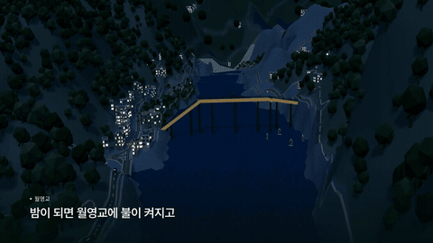

# 안동팀 — 2026 한국관광 데이터랩 활용 경진대회

「안동 이어드림」 기획의 분석·조사 저장소입니다. 작업 맥락과 규칙은 **`CLAUDE.md`**가 정본입니다(Claude Code가 세션 시작 때 자동으로 읽음). 팀 작업 목록은 아티팩트 「안동팀 작업 목록」에 있습니다.

## 안동 이어드림 웹 체험

**[실행 사이트](https://andong-atlas-production.up.railway.app/?layout=atlas)** · **[1인칭 릴레이](https://andong-atlas-production.up.railway.app/?experience=relay)** · **[앱 README·설치 방법](andong-atlas/README.md)**

안동의 3D 지도에서 장소를 탐색하고, 찜닭골목 식사 → 영수증 인증 → 전통 체험 → 저녁 이동 → 월영교·야간 팝업을 직접 체험하는 웹 프로토타입입니다.

[](andong-atlas/docs/media/andong-overview.mp4)

- [사이트 소개 영상 · 76초](andong-atlas/docs/media/andong-overview.mp4)
- [릴레이 체험 설명 영상 · 72초](andong-atlas/docs/media/andong-relay.mp4)
- [실행 화면·조작법·기능 설명](andong-atlas/README.md)

영상은 실제 웹 3D 화면을 편집한 소개 자료입니다. 식당·공방·팝업과 인증·결제·할인은 기획 시연이며 실제 거래나 예약은 발생하지 않습니다.

## 폴더 구성

| 폴더 | 내용 |
|---|---|
| `조사/` | 작업 목록 1~19번 조사 결과(엑셀·CSV). 두 자리 번호(01~12)가 현재 작업 목록 번호 |
| `보고서/` | 분석 보고서·검증 메모 |
| `scripts/` | 수집·분석·엑셀 생성 스크립트 |
| `data/` | 원자료(데이터랩 BDT·API, 팀원 취합, 외부 수집본, 정보공개청구 회신) |
| `andong-atlas/` | 3D 지도·1인칭 릴레이 웹 앱, README와 설명 영상 |
| `_보관/` | 폐기한 초기 기획(참고용) |

## 원격(클라우드)에서 처음 작업할 때

```bash
pip install -r requirements.txt
bash scripts/원자료_복원.sh
```

- 두 번째 줄은 100MB가 넘어 압축본(`.csv.gz`)으로만 올린 원자료 10개(이동통신 방문자 교차표 2018~2026, 시도별 외지인 카드지출 대용량)를 원래 경로에 풉니다. 스크립트는 로컬과 같은 경로를 그대로 씁니다.
- 로컬(맥)에서는 `.venv_pdf/bin/python`을, 원격에서는 `python3`을 씁니다.
- 한국관광공사 TourAPI 등 API 키는 저장소에 넣지 않습니다. 필요하면 원격 환경 설정의 환경 변수로 넣습니다.

## 저장소에 없는 것

- 가상환경(`.venv_pdf`, `.venv_sel`)과 캐시
- 100MB 넘는 원자료의 압축 전 원본(압축본은 있음)
