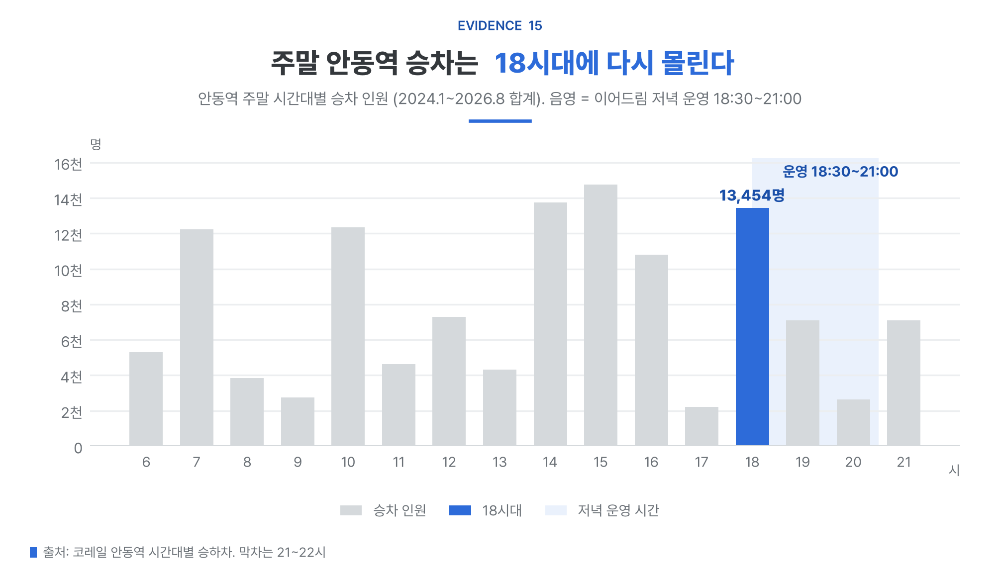
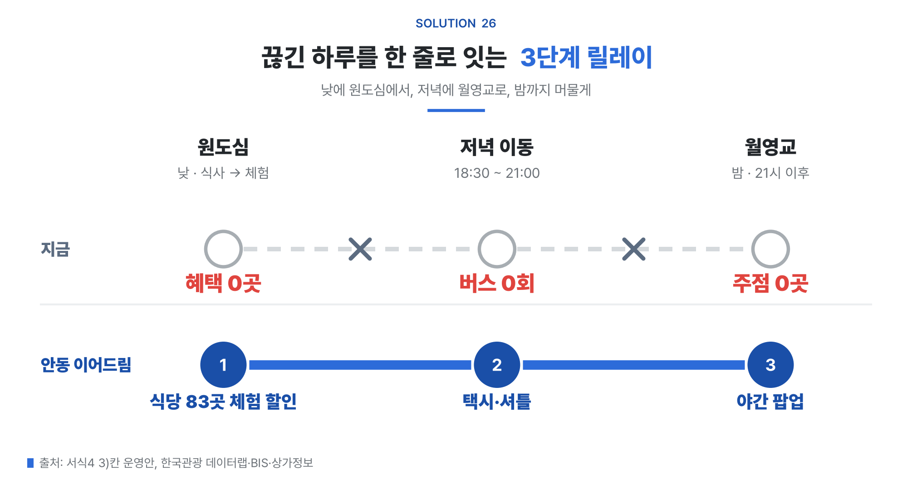

# 안동팀 · 2026 한국관광 데이터랩 활용 경진대회

「안동 이어드림」 기획의 **분석·조사 저장소**입니다. 데이터랩 자료 수집과 분석, 서식4 활용사례, 대시보드, 분석보고서, 설명 영상 편집 프로젝트가 들어 있습니다.

3D 지도·1인칭 체험 웹 앱은 별도 저장소 **[andong-3d-atlas](https://github.com/kysk2295/andong-3d-atlas)** 에 있고, 이 저장소에는 `andong-atlas/` 서브모듈로 연결되어 있습니다.

| 저장소 | 내용 |
|---|---|
| **andong-datalab-2026** (여기) | 데이터랩 분석, 조사, 제출 문서, 대시보드, 보고서, 영상 편집 프로젝트 |
| [andong-3d-atlas](https://github.com/kysk2295/andong-3d-atlas) | 3D 지도·1인칭 릴레이 웹 앱 소스, 설명 영상, 검증 기록 |

## 기획 한 줄

디지털 관광주민증 위 3단계 릴레이(① 원도심 식음 → 체험, ② 저녁 이동 18:30~21:00, ③ 월영교 야간 팝업)로, 원도심에서 쓰는 돈과 월영교에 모이는 사람을 밤까지 잇습니다.

- 문제 1: 안동의 방문당 체험·문화 소비가 183.5원에서 152.7원으로 16.8% 줄었습니다(146곳 중 22위, 전국 중앙값 −2.0%).
- 문제 2: 월영교는 방문 비중 15.24%에 비해 소비 건수 비중이 6.05%입니다. 반경 1km 안 주점 0곳, 112번 버스 19시 이후 0회입니다.

자세한 설계는 [`docs/분석설계.md`](docs/분석설계.md), 확정 결론과 근거 수치는 [`docs/결정기록.md`](docs/결정기록.md)에 있습니다.

## 데이터 분석 흐름 (서식4 순서)

최종 제출본 서식4 활용사례([`보고서/서식4_20260923/안동이어드림_서식4_활용사례_20260923.docx`](보고서/서식4_20260923/))의 네 칸(문제점 → 데이터 활용 방안 → 사업 개선·적용 → 기대효과) 순서 그대로 옮겼습니다. 문장과 숫자는 서식4 원문을 따릅니다.

| 항목 | 서식4 내용 |
|---|---|
| 응모작 제목 | 사람이 모이는 곳엔 혜택이 없고, 막차 앞에서 밤이 끊긴다: 데이터로 다시 잇는 안동 이어드림 |
| 성과분야 | 전략수립 및 기획 |
| 핵심성과 | 데이터랩 방문·시간대·카드소비와 철도·상가·주민증·설문 데이터를 융합해 원도심 → 체험 → 월영교로 잇는 3단계 야간 릴레이를 설계, 체험 결제 연 2.2만 건·방문 1회당 체험·문화 소비 +3.5% 예상(참여 2% 기준) |
| 계량성과 | 온라인 설문 103명(안동 방문 경험 72명) 수행 |

### 서식4 흐름 참고자료(최종 PDF 캡처)

최종본 [`안동이어드림_서식4흐름_참고자료_20260929.pdf`](보고서/그림보고서_20260929/안동이어드림_서식4흐름_참고자료_20260929.pdf) 9쪽을 그대로 캡처했습니다. 그림을 누르면 크게 볼 수 있습니다.

<p>
  <a href="보고서/그림보고서_20260929/캡처/p-1.png"></a>
  <a href="보고서/그림보고서_20260929/캡처/p-2.png"></a>
  <a href="보고서/그림보고서_20260929/캡처/p-3.png"></a>
  <a href="보고서/그림보고서_20260929/캡처/p-4.png"></a>
  <a href="보고서/그림보고서_20260929/캡처/p-5.png"></a>
  <a href="보고서/그림보고서_20260929/캡처/p-6.png"></a>
  <a href="보고서/그림보고서_20260929/캡처/p-7.png"></a>
  <a href="보고서/그림보고서_20260929/캡처/p-8.png"></a>
  <a href="보고서/그림보고서_20260929/캡처/p-9.png"></a>
</p>

### 사용한 데이터

| 구분 | 데이터 |
|---|---|
| 한국관광 데이터랩 | 지역별 관광 현황(외지인 방문자·요일·시간대, 읍면동 방문자), 신용카드 관광소비(업종별), 숙박 현황, 중심-연관 관광지, 내비게이션 목적지 검색, 야간관광 현황, 축제 현황 |
| 다른 기관 | 코레일 안동역 시간대별 승하차(2024.1~2026.8), 한국철도공사 8대 도시(안동) 가명결합 분석(2022.4~6), 소상공인 상가(상권)정보(2026.6), 안동시 디지털 관광주민증 혜택업체·이용 건수(정보공개청구), 관광지식정보시스템 주요관광지점 입장객, 안동시 버스정보시스템 시간표 |
| 팀 수집 | 온라인 설문 103명(2026.9.23~24, 안동 방문 경험 72명), 월영교 반경 1km 음식점 영업 종료 확인 |

카드 소비는 외지인 기준이고, 철도공사 2022년 자료(소비 = 건수)는 데이터랩 수치와 별개 체계라 같은 표에 섞지 않았습니다.

### 1) 문제점 또는 현안사항

<p>
  
  
</p>

**1) [체험·문화 소비] 방문객 증가 대비 체험 소비 급감(−16.8%, 전국 중앙값 −2.0%)과 유료 콘텐츠 전환 부족**
- 방문객과 숙박 소비는 늘었으나, 레저용품 쇼핑을 제외한 체험·문화 소비는 방문당 183.5원(2024년 1~8월) → 152.7원(2026년 같은 기간)으로 −16.8%, 146개 시·군 중 감소폭 22번째. 수준도 경주(302.3원)의 절반(50.5%)
- 관심관광지 검색 중 역사유적지 비중은 26.4%로 경주(18.4%)보다 높아(2026년 1~8월) 볼거리를 찾는 수요는 있음
- 그러나 하회마을은 방문객 점유율 6.29% 대비 소비 건수 점유율 0.40%로 소비 전환 배율 0.06(소비 건수 점유율 ÷ 방문 점유율, 원도심 1.73, 철도공사 2022.4~6), 목적지 검색 비중도 11.4% → 5.2%(2018→2025년)로 경주 불국사·동궁과월지 등(−30%대)과 뚜렷이 구분되는 하락 → 보러 온 방문객이 지역 안에서 유료로 결제하는 데까지 이어지지 않음

**2) [원도심 혜택 공백] 외지인이 가장 많이 찾는 원도심(방문의 12.5%)에 디지털 관광주민증 혜택 업체 0곳, 혜택 이용의 95%는 관람지에서만 발생**

**3) [동선 집결 및 야간 식음 인프라 부재] 만휴정·도산서원 방문객 절반 이상이 월영교로 모이지만, 반경 1km 음식점 16곳 중 13곳(81%)이 21시 전 식사 마감·주점 0곳 → 모인 사람이 돈 쓸 곳이 없음**
- 외곽 주요 관광지 방문객의 절반 이상이 월영교를 함께 찾음(만휴정 54.8%, 도산서원 54.2%, 전체 평균 30.9%의 1.8배)
- 월영교 반경 1km 영업 음식점 16곳 중 21시까지 식사 가능 3곳(18.8%), 7곳(43.8%)이 20:00~20:30 영업 종료, 주점 0곳(팀 설문 방문객 72명 중 53%가 20시 이후 월영교 주변 식당·편의시설 부족)
- 방문 점유율 15.24% 대비 소비 건수 점유율 6.05%(소비 전환 배율 0.40), 소비 건수 중 편의점 25.8%·숙박 0.3%(철도공사 2022.4~6)
- 실질 소비 상권인 원도심(음식점 764곳, 배율 1.73)과 3.2km 떨어져 있으나 잇는 시내버스는 112번 한 노선, 원도심 출발 막차 18:45(평일) → 19시 이후 대중교통 연결 없음(설문 시내버스 이용자 73% 불편)

### 2) 현안사항 해결을 위한 데이터 활용 방안

<p>
  
  
</p>

<p>
  
  
</p>

| 서식4 항목 | 겹친 데이터 | 결과 |
|---|---|---|
| 1) 혜택 위치 진단 | [데이터랩] 읍면동별 외지인 방문 + [안동시] 주민증 혜택 업체 27곳 주소 | 방문 1위 원도심에 혜택 0곳 |
| 2) 운영 시간 결정 | [코레일] 안동역 시간대별 승차 + [팀 설문] 귀가 시각 | 주말 안동역 승차는 18~19시에 가장 많고 막차는 21~22시, 당일 귀가자 58%가 20~22시 귀가 → **18:30~21:00 운영** |
| 3) 밤의 빈 곳 확인 | [상가정보] 음식점 3,254곳 + 영업 종료 현장 확인 + [버스정보시스템] 46개 노선 시간표 | 월영교 1km 주점 0곳, 19시 이후 버스 0회 |
| 4) 효과 미리 계산 | 주민증 이용 기록·축제 방문객 소비·체험 가격 27개·팀 설문 | 1만 번 반복 계산(몬테카를로 모의실험). 설문의 "하겠다"는 선행연구대로 33~40%만 실제로 한다고 반영 |
| 5) 전국 비교 | [데이터랩] 전국 144개 시·군 | 같은 기준(체험 소비 변화·숙박일수·저녁 방문)으로 진단 → 안동과 비슷한 곳 찾기 |

### 3) 데이터 활용을 통한 사업 개선 및 적용 사례

데이터로 정한 3단계 릴레이 「안동 이어드림」: 낮에 원도심에서 식사한 방문객을 체험으로, 저녁에는 월영교로 잇는다.

<p>
  
  
</p>

| 단계 | 무엇을 하나 | 데이터 근거 |
|---|---|---|
| 1단계 낮: 식사 → 체험 | 원도심 관광 식당 83곳(찜닭골목·문화의거리)에서 식사 후 영수증 QR 인증 → 체험 10% 할인 | 방문 1위인데 혜택 0곳. 체험을 망설인 이유의 83%가 가격이 아닌 정보·예약·이동 |
| 2단계 저녁: 월영교로 이동 | 18:30~21:00 원도심 → 월영교 택시(관광택시 저녁 배치), 이용이 많아지면 셔틀 | 19시 이후 버스 0회, 안동역 막차 21~22시 |
| 3단계 밤: 월영교에서 | 저녁 문보트(10% 할인) + 21시 이후 식사·주점 팝업(월영야행 부지 활용) | 21시 식사 3곳·주점 0곳 |
| 넓히는 방법 | 식당을 4묶음으로 나눠 추첨 순서대로 참여 | 운영하면서 효과를 바로 확인 |

아직 정하지 않은 것: 팝업 부스 수·차량 대수(이용량·견적 확인 후). 인증은 영수증 QR(누구나)과 주민증 조건형 혜택을 병행(조건형 가능 여부 확인 중)

### 4) 추진성과 및 기대효과

<p>
  
  
</p>

- **1) [체험 소비 회복]** 방문당 체험·문화 소비 감소폭 −16.8%(146곳 중 22위) → 참여 2%면 −13.9%(27위), 10명 중 1명 참여하면 −2.5%로 전국 중앙 수준(−2.0%)
- **2) [원도심 혜택 공백·주민증 활성화]** 방문 1위 원도심의 혜택 업체 0곳 → 83곳(식당 → 체험 인증 월 5,452건), 주민증 조건형 혜택 병행 시 주민증 이용 월 888건 → 약 1,150건(+30%)
- **3) [밤까지 이어지는 동선]** 19시 이후 버스 0회 → 월영교에 새로 가는 저녁 이동 주말 하루 110명, 주점 0곳 → 야간 팝업 이용 주말 하루 128명
- **4) [지역 소비]** 안동 추가 소비 연 1.56억 원(할인액·원래 썼을 돈 제외), 이 중 34%는 세 단계를 이어야만 생김
- **5) [검증과 확산]** 식당 83곳을 추첨 순서로 열면 5개월 만에 효과를 85% 확률로 확인, 안동과 같은 유형 6곳(영덕·양양·남해·울진·광명·강릉)·주민증 운영 52개 지자체에 적용 가능

| 원도심 식당 83곳 운영 시 | 기준(100명 중 2명) | 흥행(4명) | 목표(10명) |
|---|---|---|---|
| 방문당 체험·문화 소비(지금 152.7원, −16.8%) | 158.0원(−13.9%) | 163.1원(−11.1%) | 179.0원(−2.5%) |
| 146곳 중 감소폭 순위(지금 22위) | 27위 | 38위 | 71위 |
| 월영교로 새로 가는 저녁 이동 | 주말 하루 110명 | 217명 | 549명 |
| 안동에서 늘어나는 소비(연간) | 1.56억 원 | 2.86억 원 | 6.91억 원 |

\* 효과는 시행 전 예측(2026년 1~8월 자료의 연간 환산, 1만 번 계산의 가운데 값, 할인액·원래 썼을 돈 제외)이며 시행 첫 달 실제 기록으로 다시 계산. 순위는 다른 시·군이 그대로일 때.

전체 그림 30장은 [`보고서/보고서그림_20260928/`](보고서/보고서그림_20260928/), 방법·모형·검정은 분석보고서 PDF에 있습니다.

## 주요 결과물

| 결과물 | 파일 | 만드는 스크립트 |
|---|---|---|
| 서식4 활용사례(대회 제출본) | [`보고서/서식4_20260923/`](보고서/서식4_20260923/) | `scripts/서식4_작성본.py` |
| 요약 대시보드(엑셀) | [`보고서/요약대시보드/`](보고서/요약대시보드/) | `scripts/요약대시보드.py` |
| 분석보고서(PDF) | [`보고서/교수님_대시보드/`](보고서/교수님_대시보드/) | `scripts/교수님_보고서.py` |
| 기대효과 시뮬레이션 | [`보고서/성과도출_20260922/`](보고서/성과도출_20260922/) | `scripts/이어드림_파라미터추정.py` → `scripts/이어드림_시뮬레이션.py` |
| 시행 후 효과 평가 계획 | 같은 폴더의 `사후검증_결과.json`·`순차도입_검정력.json` | `scripts/이어드림_사후검증_합성통제.py`, `scripts/이어드림_순차도입_검정력.py` |
| 전국 진단표 | [`보고서/전국진단_20260923/`](보고서/전국진단_20260923/) | `scripts/전국진단표.py` |
| 온라인 설문(103명) | [`data/설문/`](data/설문/), [`보고서/설문_분석_20260925.md`](보고서/설문_분석_20260925.md) | |

세 결과물(서식4·대시보드·분석보고서)은 같은 숫자 JSON을 읽습니다. 숫자를 바꿀 때는 앞단 스크립트를 고친 뒤 세 파일을 모두 다시 만듭니다.

## 설명 영상(HyperFrames 편집 프로젝트)

| 영상 | 완성본 | 편집 프로젝트 |
|---|---|---|
| 시행 전 효과 검증 · 80초 | `보고서/영상_20260928/eodream-verify/renders/` (Releases) | [`보고서/영상_20260928/eodream-verify/`](보고서/영상_20260928/eodream-verify/) |
| 릴레이 체험 · 72초 | `보고서/영상편집_20260930/eodream-relay/renders/` (Releases) | [`보고서/영상편집_20260930/eodream-relay/`](보고서/영상편집_20260930/eodream-relay/) (편집 정본 `tools/edit_plan.py`) |
| 3D 사이트 소개 · 76초 | `보고서/사이트소개영상_20260930/andong-atlas-promo/renders/` (Releases) | [`보고서/사이트소개영상_20260930/`](보고서/사이트소개영상_20260930/) |

- 촬영 원본·컷 목록·인수인계는 `보고서/영상촬영_20260930/`, 영상 기획안은 `보고서/영상기획_20260930/`에 있습니다.
- 영상 화면은 실제 3D 웹 시연입니다. 식당·공방·팝업, 인증·결제·할인, 연결차량은 기획 시연이며 실제 운영이 아닙니다.
- 음악은 프로젝트의 `tools/`에서 직접 합성했고, 효과음은 Pixabay 라이선스입니다.
- 공유용 720p 영상은 [andong-3d-atlas의 영상 문서](https://github.com/kysk2295/andong-3d-atlas/blob/main/docs/VIDEOS.md)에서 바로 볼 수 있습니다.

## 폴더 구성

| 폴더 | 내용 |
|---|---|
| `data/` | 원자료(데이터랩 BDT·API, 팀원 취합, 외부 수집본, 정보공개청구 회신, 설문) |
| `scripts/` | 수집·분석·문서 생성 스크립트 |
| `보고서/` | 분석 보고서, 제출 문서, 대시보드, 그림, 영상 프로젝트 |
| `조사/` | 작업 목록 01~16 조사 결과(엑셀·CSV) |
| `docs/` | 분석 설계, 결정 기록, 작업일지, 인수인계 가이드, 디자인 기준 |
| `andong-atlas/` | 서브모듈 → [andong-3d-atlas](https://github.com/kysk2295/andong-3d-atlas) |
| `_보관/` | 폐기한 초기 기획(참고용) |

처음 보는 사람은 [`docs/인수인계_가이드.md`](docs/인수인계_가이드.md)부터 읽으면 됩니다. 파일 위치는 [`docs/폴더안내.md`](docs/폴더안내.md)에 있습니다. `CLAUDE.md`는 작업 원칙·현재 상태·쓰면 안 되는 문장을 정리한 정본으로, Claude Code가 세션마다 읽습니다.

## 내려받기

서브모듈(3D 앱)과 함께 받습니다.

```bash
git clone --recurse-submodules https://github.com/kysk2295/andong-datalab-2026.git
```

이미 받아 둔 경우에는 저장소 폴더에서 `git submodule update --init`을 실행합니다.

5MB가 넘는 영상·zip 60개(약 2.2GB: 완성본, 촬영 원본, 편집용 클립)는 저장소 대신 **[Releases `media-20261003`](https://github.com/kysk2295/andong-datalab-2026/releases/tag/media-20261003)** 에 있습니다. 파일별 원래 경로와 SHA-256은 [`보고서/대용량_영상_목록.csv`](보고서/대용량_영상_목록.csv)에 있고, 아래 명령으로 원래 폴더에 받아 놓을 수 있습니다.

```bash
bash scripts/영상_내려받기.sh
```

완성본만 받으려면 `bash scripts/영상_내려받기.sh renders`를 실행합니다.

## 분석 환경

```bash
pip install -r requirements.txt
```

```bash
bash scripts/원자료_복원.sh
```

- 두 번째 명령은 100MB가 넘어 압축본(`.csv.gz`)으로만 올린 원자료 10개(이동통신 방문자 교차표 2018~2026, 시도별 외지인 카드지출 대용량)를 원래 경로에 풉니다.
- 로컬(맥)에서는 `.venv_pdf/bin/python`, 원격에서는 `python3`을 씁니다.
- TourAPI 등 API 키는 저장소에 넣지 않습니다. 필요하면 환경 변수로 넣습니다.

## 저장소에 없는 것

- 가상환경(`.venv_pdf`, `.venv_sel`)과 캐시, 영상 편집 도구의 로컬 캐시(`.hyperframes/`)
- 100MB가 넘는 원자료의 압축 전 원본(압축본은 있음)
- 5MB가 넘는 영상·zip(Releases에 있음, 위 「내려받기」 참고)
- 중복 사본: `보고서그림_20260928 2·3.zip`, `웹소개_핵심이미지_20260930 2/`, `안동이어드림_클로드전달_촬영패키지.zip`(내용은 `보고서/영상촬영_20260930/`에 그대로 있음)
