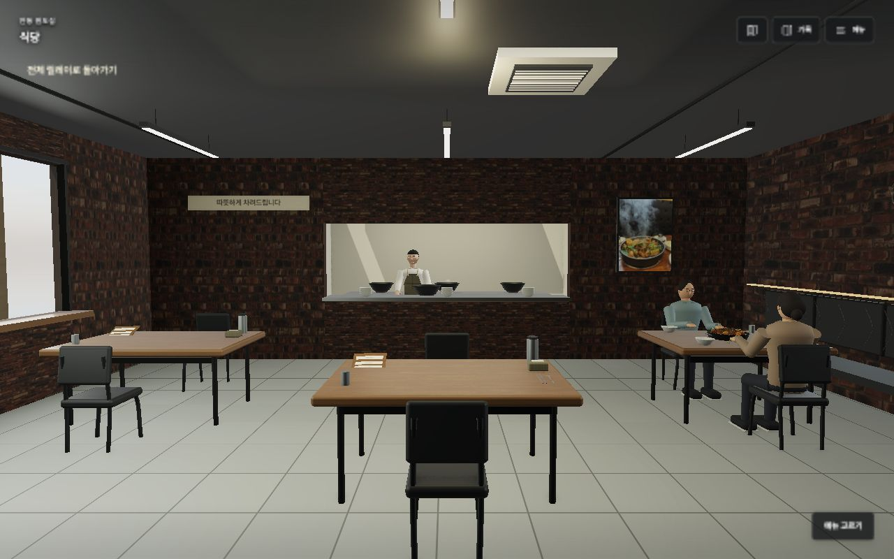
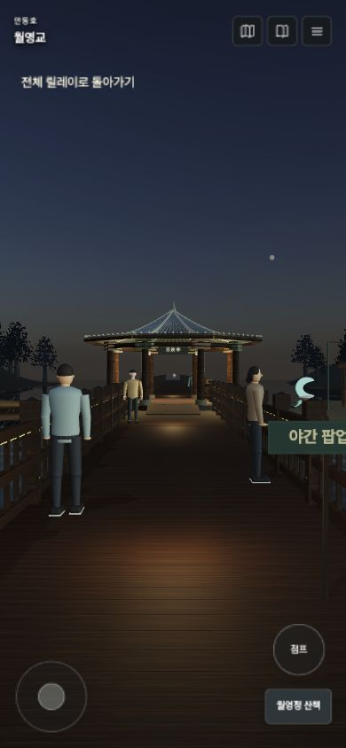
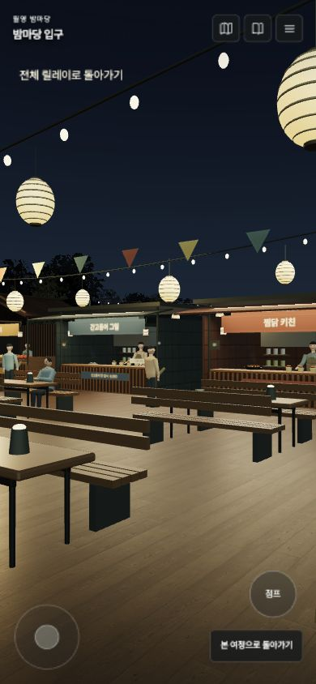

# 안동 이어드림 · 3D Atlas & 1인칭 릴레이

**한 끼의 식사가 전통 체험과 안동의 밤까지 이어지는 여행.**

안동의 지형·건물·관광 정보를 3D 지도에서 살펴보고, 찜닭골목에서 식사·영수증 인증·전통 체험·이동·월영교·야간 팝업을 직접 조작하는 웹 프로토타입입니다. 한국관광 데이터랩 활용 경진대회 「안동 이어드림」 기획을 체험 가능한 형태로 구현했습니다.

**[3D 지도 열기](https://andong-atlas-production.up.railway.app/?layout=atlas)** · **[1인칭 여행 시작](https://andong-atlas-production.up.railway.app/?experience=relay)** · **[야간 팝업 바로 체험](https://andong-atlas-production.up.railway.app/?experience=relay&visit=popup&at=popup)**

[](docs/media/andong-overview.mp4)

## 설명 영상

| 영상 | 내용 | 재생·다운로드 |
|---|---|---|
| 사이트 소개 · 76초 | 3D 지도, 하회마을과 원도심, 낮과 밤, 1인칭 체험 | [MP4 보기](docs/media/andong-overview.mp4) · [다운로드](https://raw.githubusercontent.com/kysk2295/andong-datalab-2026/main/andong-atlas/docs/media/andong-overview.mp4) |
| 릴레이 체험 · 72초 | 골목 → 식사 → 결제·QR → 체험 할인 → 공방 → 월영교·팝업 | [MP4 보기](docs/media/andong-relay.mp4) · [다운로드](https://raw.githubusercontent.com/kysk2295/andong-datalab-2026/main/andong-atlas/docs/media/andong-relay.mp4) |

실제 웹 3D 화면을 편집한 한국어 자막·음악 포함 영상입니다. 1280×720 H.264/AAC MP4로 첨부했습니다. 영상은 2026-09-30 제작 당시 화면이며, 이후 추가된 v1.30 방문객·정류장 개선은 아래 실행 화면과 배포 사이트에서 확인할 수 있습니다. [영상 정보·출처](docs/VIDEOS.md)

## 어떤 것을 체험하나요?

사업의 세 단계는 **원도심 소비 → 전통 체험 → 야간 체류**입니다. 영수증 인증은 식사에서 다음 체험으로 넘어가는 연결 과정입니다.

| 흐름 | 사용자가 하는 행동 |
|---|---|
| ① 원도심에서 식사 | 찜닭골목 걷기, 식당 출입, 가운데·창가 자리 선택, 메뉴 주문, 음식 집어 맛보기, 카드·현금 결제 시연, 영수증 수령 |
| 영수증 인증 | 영수증의 QR을 화면에 맞추기, 체험 할인권 발급, 공방에서 할인권 사용 |
| ② 손으로 전통 체험 | 하회탈에 직접 색칠하기, 국화꽃 담고 차 우리기, 전통주 제조 과정의 재료·도구 조작 |
| 저녁 이동 | 공방에서 정류장으로 걷기, 승객 눈높이로 버스 타기, 창밖·차내 둘러보기, 하차 벨과 통로 이동 |
| ③ 월영교와 야간 팝업 | 다리와 강변 걷기, 흐르는 수면과 야경 감상, 9개 부스 방문, 음식·차 맛보기, 투호·장단 놀이, 엽서·사진 저장 |

지도에서는 **관광주민증 혜택업체**, **릴레이 단계 연결선**, **입체 팝업 부스**를 각각 켜고 끌 수 있습니다. 명소 정보와 대시보드에서도 관련 1인칭 체험으로 바로 들어갑니다.

전체 여정과 장소별 바로 체험 기록은 브라우저에 별도로 저장합니다. 실제 인증·예약·구매는 발생하지 않습니다.

## 실행 화면 · v1.30



<p>
  
  
</p>

v1.30에서는 식당·공방·골목·월영교·팝업 방문객을 보강했습니다. 착석 인물의 상체·발 높이, 공방 의자와 팝업 벤치 방향, 골목 출구 배경을 수정했고, 승하차 지점과 차내에서 동일한 10.25m 버스 모델을 사용합니다.

## 조작법

| 입력 | 동작 |
|---|---|
| 마우스·터치 드래그 | 주변 둘러보기 |
| W A S D / ↑ ↓ | 걷기 |
| ← → | 시선 회전 |
| Shift | 빠르게 이동 |
| Space | 점프 |
| E / 가까운 물건 클릭 | 상호작용 |
| R | 시점 복원 |
| 공간 메뉴 | 원하는 자리로 이동, 소리·화면 설정, 사진·현장 정보 |
| 모바일 왼쪽 조이스틱 / 점프 버튼 | 걷기 / 점프 |

음식·공예 도구는 화면에서 직접 끌어 조작합니다. 각 체험에는 키보드 대체 조작도 있습니다. 지원되는 브라우저에서는 공간 메뉴의 마우스 고정을 사용할 수 있고, Esc로 해제합니다. 소리는 첫 사용자 조작 이후 재생되며 메뉴에서 끌 수 있습니다.

## 로컬 실행

Node.js 22 환경을 기준으로 배포합니다. 테스트에는 Python 3도 필요합니다. 지도·재질·모델 등 실행용 자료는 저장소에 포함되어 있어 처음 실행할 때 전체 데이터를 다시 수집할 필요가 없습니다.

```bash
git clone https://github.com/kysk2295/andong-datalab-2026.git
cd andong-datalab-2026/andong-atlas
npm ci
npm run dev -- --port 4174
```

브라우저에서 아래 주소를 엽니다.

- 지도: `http://localhost:4174/?layout=atlas`
- 전체 체험: `http://localhost:4174/?experience=relay`
- 식당: `http://localhost:4174/?experience=relay&visit=meal&at=meal`
- 공방: `http://localhost:4174/?experience=relay&visit=workshop&at=workshop`
- 버스: `http://localhost:4174/?experience=relay&visit=transit&at=transit`
- 팝업: `http://localhost:4174/?experience=relay&visit=popup&at=popup`

카카오 로드뷰 SDK는 선택 기능입니다. 필요하면 `.env.example`을 참고해 `.env.local`에 `VITE_KAKAO_MAP_KEY`를 설정합니다. 키 없이도 3D 지도와 릴레이 체험을 실행할 수 있습니다. 로컬 환경 파일은 Git에 포함하지 않습니다.

## 빌드와 검증

```bash
npm test
npm run build
npm run preview -- --port 4174
```

`npm test`에는 상위 분석 폴더의 원자료와 앱 집계값 대조가 포함됩니다. 앱 폴더만 따로 복사하지 말고 저장소 전체를 내려받아 실행하세요. v1.30의 자동 검사 **230개가 통과**했으며, PC 1280×800 및 모바일 390×844에서 식당 출입, 공방 체험, 버스 승하차, 월영교 연결을 점검했습니다. [상세 검증 기록](QA.md)

독립 서버로 실행하려면 빌드 후 다음 명령을 사용합니다.

```bash
PORT=8080 node server.mjs
```

Docker도 앱 폴더에서 빌드합니다.

```bash
docker build -t andong-atlas .
docker run --rm -p 8080:8080 andong-atlas
```

현재 공개 서비스는 Railway에 배포되어 있습니다. 소스 업로드 범위는 이 앱 폴더로 지정해야 합니다. 상위 분석 저장소에는 앱 실행에 필요 없는 대용량 보고서와 촬영 원본이 있습니다.

## 구성

```text
andong-atlas/
├── src/          # Three.js 지도·릴레이 장면, 입력, 체험과 화면
├── public/
│   ├── data/     # 지도·교통·분석 집계·출처 메타데이터
│   └── assets/   # 사진, 3D 모델, 재질, 글꼴
├── scripts/      # 공개 자료 수집·전처리·압축
├── tests/        # 이동, 체험 상태, 데이터·기하 검증
├── docs/         # 설명 영상, 실행 화면, 소개 문서
├── server.mjs    # 배포용 정적 파일 서버
└── Dockerfile    # Node.js 22 빌드·실행 환경
```

Three.js와 Vite를 사용합니다. 자료 재생성은 `npm run data` 및 `scripts/`의 개별 도구로 수행하며, 상위 저장소의 분석 원본·추가 Python 의존성·네트워크 접근이 필요할 수 있습니다. 재수집 명령은 일반 실행 과정에 포함하지 않습니다.

## 실제 자료와 기획 시연의 구분

- 지형·건물 윤곽·시설 좌표는 공개 자료를 가공한 것입니다. 표현을 위한 보정과 단순화가 포함되며 측량 정확도를 의미하지 않습니다.
- 원도심 시연 식당, 전통 체험 거점, 연결차량, 야간 팝업 배치와 할인 금액은 사업 기획을 체험하기 위한 재구성입니다. 실제 운영 중인 가맹점·노선·행사로 해석하지 않습니다.
- 인물·음식·건물 외관은 절차적 3D 모델과 사진 기반 재질입니다. 실사 스캔, 완전한 오픈월드, 군중·교통 자율 AI 구현은 아닙니다.
- 방문 정보와 교통 자료에는 수집 시점이 있습니다. 실제 여행 전에 해당 기관의 최신 정보를 확인해야 합니다.
- 기대효과는 기존 분석의 시나리오 결과이며, 예측 범위는 모형 가정에 따른 범위입니다.

## 출처와 문서

[출처·에셋 이용 조건](docs/ATTRIBUTIONS.md)에는 지도, 표고, 건물, 사진, 재질, 영상의 출처를 정리했습니다. 원천별 이용 조건이 다르므로 저장소 전체에 단일 에셋 라이선스를 적용하지 않습니다.

- [릴레이 구현 문서](RELAY_IMPLEMENTATION.md)
- [검증 기록](QA.md)
- [사진과 구현 비교](REFERENCE_COMPARISON.md)
- [영상 정보](docs/VIDEOS.md)
- [상위 분석·조사 저장소](../README.md)
