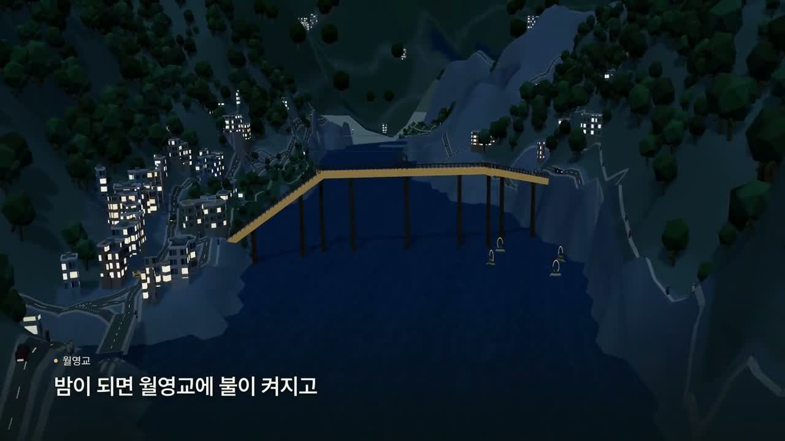
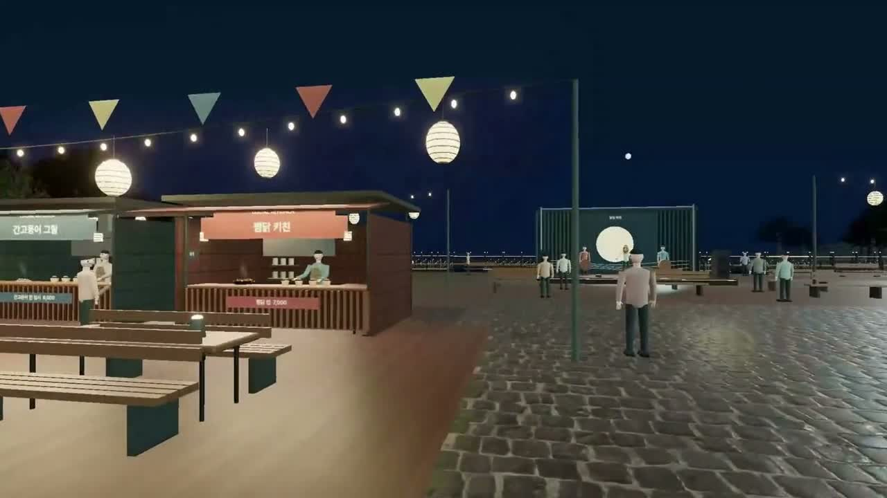

# 안동 이어드림 설명 영상

앱을 처음 보는 사람이 지도 탐색과 릴레이의 흐름을 이해할 수 있도록 제작한 영상 두 편입니다. 2026-09-30 완성된 편집본을 공유용으로 압축했습니다.

## 사이트 소개 · 76초

**[MP4 재생](media/andong-overview.mp4)** · **[다운로드](https://raw.githubusercontent.com/kysk2295/andong-datalab-2026/main/andong-atlas/docs/media/andong-overview.mp4)**

3D 안동 전경에서 하회마을·원도심으로 들어가고, 사이트 조작과 낮·밤 전환, 월영교 야경 및 1인칭 체험을 소개합니다. 실제 웹 3D 화면을 촬영해 편집했으며 한국어 자막과 배경음이 포함됩니다.

## 릴레이 체험 · 72초

**[MP4 재생](media/andong-relay.mp4)** · **[다운로드](https://raw.githubusercontent.com/kysk2295/andong-datalab-2026/main/andong-atlas/docs/media/andong-relay.mp4)**

찜닭골목과 식사, 결제·영수증, QR 인증, 다음 체험 할인, 전통 공방, 저녁 이동과 월영교·팝업을 잇는 사용자 흐름을 보여줍니다. 인증·결제·혜택·연결차량·팝업 운영은 기획 시연입니다.

## 파일 정보

| 파일 | 길이 | 화면 | 형식 | 용량 |
|---|---:|---|---|---:|
| `andong-overview.mp4` | 76.01초 | 1280×720 · 30fps | H.264 / AAC | 약 26.14 MiB |
| `andong-relay.mp4` | 72.30초 | 1280×720 · 30fps | H.264 / AAC | 약 14.72 MiB |

MP4는 앞부분부터 재생할 수 있도록 fast-start 정보를 포함합니다. README의 GIF는 사이트 소개 중 6초를 추출한 무음 미리보기입니다. MP4를 열었을 때 바로 재생되지 않으면 다운로드 링크를 이용하세요.

영상은 제작 당시 화면입니다. 이후 v1.30에서 추가된 방문객·정류장 차량·골목 출구 수정은 [현재 실행 사이트](https://andong-atlas-production.up.railway.app/?experience=relay)와 [최신 실행 화면](../README.md#실행-화면--v130)에서 확인할 수 있습니다.

## 제작 기록과 출처

- 원본 편집본: `안동3DAtlas_사이트소개_76초.mp4`, `안동이어드림_한끼에서안동의밤까지_72초_v2.mp4`.
- 영상 소스: 이 프로젝트의 실제 WebGL 지도·1인칭 체험 화면. 일부 공간·동선·혜택은 제안 모델.
- 음악: 기존 제작 기록의 자체 합성 배경음·앱 합성 환경음.
- 효과음: 기존 제작 기록상 Pixabay의 `click-soft`, `whoosh-short`, 릴레이 영상의 `chime`. 원 제작물의 [Pixabay Content License](https://pixabay.com/service/license-summary/) 출처 표시를 유지합니다. 효과음 원파일은 이 문서 폴더에서 별도 배포하지 않습니다.
- 글꼴: Pretendard, SIL Open Font License 1.1.
- 지도와 배경 자료: OpenStreetMap contributors / OpenFreeMap, SGIS 기반 행정경계 등. [전체 출처 목록](ATTRIBUTIONS.md).

고용량 원본·촬영 클립·임시 렌더·편집 캐시는 제외하고 공유용 완성본만 Git에 포함했습니다.
