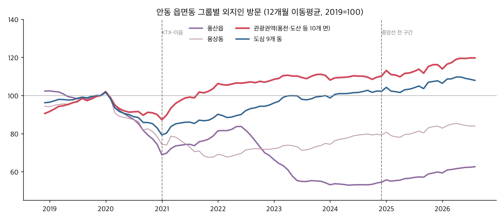
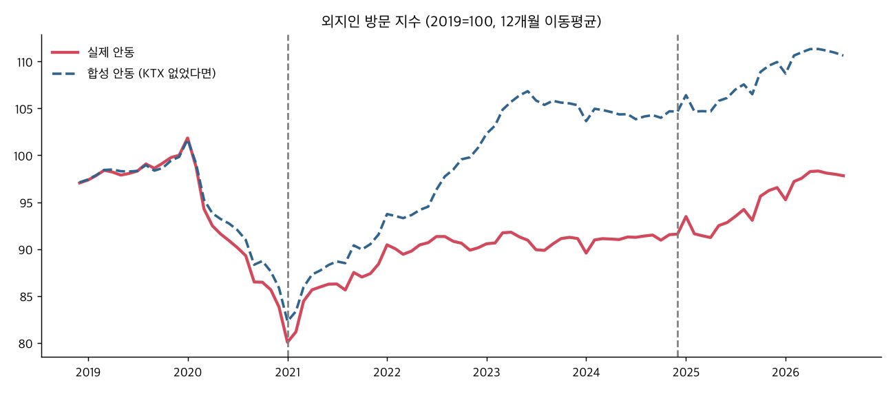
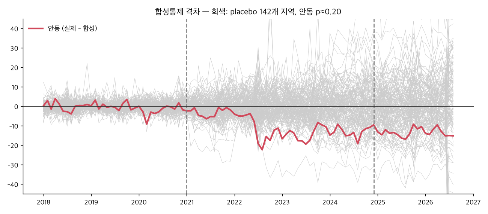

# 안동 교통 호재 — 2차 분석 (검증·정정·심화)

> 2026-09-11 · 1차 보고서(`안동_교통호재_관광변화_분석.md`)의 핵심 주장을 **다시 검증**하고 새 데이터로 심화했다.
> 새로 수집한 데이터 (전부 데이터랩 API 재호출):
> - 안동·경주·영주 **읍면동별 외지인 방문** 연도별 + 안동 월별 104개월 (`BDT_01_01_005_1`)
> - 7개 시군구 **관광지 검색 Top100** 연도별 (`LN_03_01_037`)
>
> 스크립트: `scripts/안동_2차_API수집.py` · `안동_읍면동_월별수집.py` · `안동_합성통제.py` · `안동_합성통제_강건성.py` · `안동_읍면동_보정분석.py`

---

## 0. 결론부터 — 1차 결론을 정정한다

| 1차 주장 | 2차 검증 결과 | 판정 |
|---|---|---|
| "KTX가 생겼는데 안동 외지인은 전국 하위 2%" | 수치는 맞다. 다만 **감소분 대부분이 풍산읍·용상동(비관광 지역)** 에서 나왔다. 두 곳만 −31%이고, **관광권역은 +16%** 다 | ⚠️ **정정** |
| "합성통제로 본 KTX 효과 −12~14%" | 격차는 실재한다(한쪽 방향 검정 p=0.03~0.09). 그런데 연간 부족분 약 250만 명이 **풍산·용상 감소분 약 208만 명과 거의 같다** | ⚠️ **관광 효과로 해석 불가** |
| "수도권·원거리 방문 −14%" | 시군 전체 기준 값이라 풍산읍(서안동IC·산업단지) 경유 수요 감소가 섞였을 가능성이 있다 | △ 보류 |
| "사람은 늘고 돈은 줄었다 (2024.12 이후)" | **관광권역 기준으로 더 선명해졌다.** 관광권역 방문 +10.1%, 카드소비 −10.7% | ✅ **강화** |
| "철도는 새 수요가 아니라 수단 전환" | 터미널 검색 −50%, 역 검색 +16%, 주유 소비 −9.5%(다른 도시는 모두 증가) | ✅ **강화** |

> ### 새 핵심 문장
> **"KTX-이음은 관광객을 데려왔다. 그런데 그들은 돈을 쓰지 않는다."**
> 안동 관광권역 외지인 방문은 2019년 대비 **+16%**, 외지인 관광소비는 **+7%** 다. 경주는 방문 +23%에 소비 +23%로 1:1이다.
> 부산 직결 뒤(2026 vs 2024, 1~8월) 관광권역 방문은 **+10.1%**, 관광소비는 **−10.7%**, 1인당 소비는 **−16.2%** 다.
> 원인 가설: **자동차 → 기차로 수단이 바뀌면서, 도착한 뒤 현지에서 이동할 수단이 사라졌다. 그래서 소비 반경이 줄었다.**

---

## 1. 안동 감소의 정체 — 읍면동으로 쪼개 보기

**읍면동 그룹별 외지인 방문 지수 (2019=100)**

| | 2020 | 2021 | 2022 | 2023 | 2024 | 2025 |
|---|---|---|---|---|---|---|
| 안동 읍면동 합계 | 82.9 | 88.1 | 91.6 | 93.0 | 94.4 | 100.0 |
| **안동 (풍산읍·용상동 제외)** | 85.2 | 92.7 | 99.0 | 103.3 | 104.6 | **110.4** |
| **안동 관광권역** (풍천·도산·서후·와룡 등 10개 면) | 90.0 | **103.6** | 107.6 | 110.5 | 110.2 | **116.2** |
| 안동 도심 (9개 동) | 83.0 | 88.2 | 94.9 | 100.0 | 102.2 | 107.7 |
| **안동 풍산읍+용상동** | 75.9 | 74.4 | 69.8 | **62.2** | 64.1 | 69.2 |
| 경주 관광권역 (황남·불국·보덕 등) | 78.3 | 95.1 | 108.8 | 115.8 | 114.2 | 122.7 |
| 경주 읍면동 합계 | 79.9 | 93.3 | 109.0 | 114.6 | 113.9 | 123.2 |
| 영주 관광권역 (풍기·부석·순흥 등) | 80.5 | 90.3 | 107.3 | 98.2 | 100.6 | 102.8 |
| 영주 읍면동 합계 | 83.9 | 88.5 | 99.0 | 98.7 | 102.7 | 108.4 |

**주요 읍면동 (외지인 방문, 2019 → 2025)**

| 읍면동 | 성격 | 2019 | 2025 | 증감 |
|---|---|---|---|---|
| **풍산읍** | 산업단지(바이오)·서안동IC | 411만 | 246만 | **−40.2%** |
| 용상동 | 주거·상권 | 264만 | 221만 | −16.1% |
| **도산면** | 도산서원 | 45만 | 63만 | **+40.6%** |
| 남후면 | | 53만 | 70만 | +32.0% |
| **풍천면** | 하회마을·병산서원·도청 신도시 | 169만 | 213만 | **+26.0%** |
| 서구동 | 원도심 | 215만 | 272만 | +26.8% |
| 일직면 | | 46만 | 58만 | +25.0% |
| 서후면 | 봉정사 | 81만 | 88만 | +9.5% |
| 송하동 | 신 안동역·터미널 | 111만 | 117만 | +5.3% |

- **감소 시점 (월별 104개월 재수집)**: 용상동은 **2021년 1월에 절반으로 계단식 하락**했다(20.7만 → 9.8만). 풍산읍은 **2022년 7월 전후로 30~40만 수준에서 17~22만 수준으로 떨어진 뒤 회복하지 못했다.** 둘 다 관광 수요라면 이런 모양이 나오기 어렵다.
- 풍산읍 감소 원인은 **확인하지 못했다.** 가능성은 세 가지다. ① 풍산 바이오단지의 코로나 백신 생산 축소: SK바이오사이언스 스카이코비원 생산 중단이 2022년 하반기다 ([청년의사](http://www.docdocdoc.co.kr/news/articleView.html?idxno=2029613)). ② 34번 국도·고속도로 경유 수요 변화 ([나무위키: 서안동IC](https://namu.wiki/w/%EC%84%9C%EC%95%88%EB%8F%99IC)). ③ 통신 기지국 배치나 산출 변경. **발표에서는 "비관광 지역 감소"로만 표현할 것.**
- **결론: 안동 관광지는 KTX 이후 성장했다.** 관광권역 +16%는 경주(+23%)보다 낮고 영주(+3%)보다 높다.

---

## 2. 합성통제 — 격차는 있지만 관광 효과는 아니다

전국 시·군 가운데 KTX-이음 정차 도시를 뺀 178곳을 가중 조합해 "KTX가 없었다면의 안동"을 만들었다 (사전 기간 2018.01~2020.12).

| 설정 | 사전 적합 오차 | 2022~25 평균 격차 | 2025 격차 | p (전체 placebo) | p (음의 격차, 단측) | 주요 가중치 |
|---|---|---|---|---|---|---|
| 기본 | 2.52 | −12.8p | −13.4p | 0.20 | **0.042** | 예천 0.34, 경산 0.31, 정선 0.13 |
| 인접·생활권 시군 제외 | 3.06 | −10.9p | −10.9p | 0.45 | 0.087 | 경산 0.39, 부여 0.17, 무주 0.12 |
| 인접 제외 + 사전 기간 코로나 이전만 | 1.14 | −18.3p | −19.6p | 0.06 | **0.029** | 경산 0.22, 홍성 0.13, 고흥 0.12 |

- 격차 방향은 모든 설정에서 일관되게 음(−)이다. 한쪽 방향 검정 p도 0.03~0.09다.
- **하지만 격차의 크기와 시점이 풍산·용상 감소와 겹친다.** 합성 대비 부족 방문은 연 203~270만 명이고(2022~2025), 풍산·용상 감소분은 약 208만 명(2019 대비 2023년)이다. 격차가 2021년이 아니라 **2022년부터** 벌어지는 것도 풍산읍 하락 시점(2022년 중반)과 맞는다.
- → **공모전에서 "KTX 역효과"의 인과 근거로 쓰면 안 된다.** 대신 방법론 슬라이드에 "시군 단위 지표는 비관광 변동에 오염된다 → 읍면동 단위로 정밀 분석했다"로 쓰면 **데이터 활용도 점수**를 받을 수 있다.

---

## 3. 진짜 문제 — 방문은 늘었는데 소비는 따라오지 않는다

**관광권역 방문 vs 외지인 관광소비 (2019=100)**

| | 관광권역 방문 2025 | 카드 관광소비 2025 | 전환 격차 |
|---|---|---|---|
| **안동** | **116.2** | **107.3** | **−8.9p** |
| 경주 | 122.7 | 123.2 | +0.5p |
| 영주 | 102.8 | 103.4 | +0.6p |

**중앙선 전 구간 개통 전후 (1~8월 합계)**

| 안동 | 2019 | 2024 | 2025 | 2026 | 2026 vs 2024 |
|---|---|---|---|---|---|
| 관광권역 방문 (만) | 349 | 375 | 394 | **413** | **+10.1%** |
| 도심 방문 (만) | 906 | 912 | 951 | 953 | +4.5% |
| 송하동(역 주변) 방문 (만) | 73 | 74 | 75 | 82 | **+10.8%** |
| 외지인 관광소비 (억) | — | 1,796 | 1,729 | **1,603** | **−10.7%** |

→ **관광권역 방문이 늘수록 소비가 줄어드는 역방향 흐름이다.** 비교 도시 가운데 이런 흐름은 안동에서만 보인다 (경주는 방문 +8.5%, 소비 +0.4%).

**어떤 업종이 줄었나 (외지인 카드소비, 2026 vs 2024, 1~8월, %)**

| 업종 | **안동** | 경주 | 포항 | 전주 | 군산 |
|---|---|---|---|---|---|
| 관광총소비 | **−10.7** | +0.4 | −7.1 | −7.0 | −0.5 |
| **육상운송 (주유 중심)** | **−9.5** | +6.1 | +2.8 | +1.5 | +22.6 |
| 일반외식업 | −4.2 | +3.9 | −10.3 | −3.8 | −5.7 |
| 제과음료업 | −4.8 | +20.9 | +47.1 | −0.4 | +12.1 |
| 기타관광쇼핑 | −8.6 | +1.6 | −8.9 | −6.0 | −3.6 |
| 대형쇼핑몰 | −37.7 | −23.2 | −24.6 | −26.8 | −8.6 |
| **기타숙박 (모텔·여관급)** | **+49.9** | −18.7 | −29.4 | +2.3 | −24.9 |
| 호텔 | −11.5 | −28.3 | −18.6 | −4.5 | −40.9 |
| 골프장 | −32.0 | −22.7 | −13.2 | −20.8 | −3.4 |
| **문화서비스** | **−42.4** | +11.8 | −30.9 | −39.9 | −13.6 |

- **주유 소비가 줄어든 곳은 안동뿐이다 (−9.5%).** 다른 네 도시는 모두 늘었다. 방문은 늘었는데 자동차 연료 소비는 줄었다는 건 **차 대신 기차로 오는 방문객이 늘었다**는 해석과 맞는다.
- 숙박은 모텔급만 +50% 늘었다. 1박을 하긴 하는데 **저가 숙박으로 흡수되고 있다.**
- 제과·카페 소비(경주 +21%, 포항 +47%)도 안동만 줄었다. **차 없이 도착한 관광객의 소비 동선이 좁아졌다**는 신호다.

---

## 4. 수단 전환의 증거 — 관광지 검색 Top100 (T map 목적지 검색)

**안동 목적지 검색 (연간, 건)**

| 목적지 | 2019 | 2021 | 2023 | 2025 | 2019→2025 | 2026 vs 2024 (1~8월) |
|---|---|---|---|---|---|---|
| 안동하회마을 | 68,859 | 66,447 | 76,922 | 65,417 | −5% | −4% |
| 월영교 | 40,147 | 47,280 | 54,896 | 46,679 | +16% | −30% |
| 안동구시장 | 31,185 | 35,219 | 46,000 | 43,512 | +40% | −61% ※ |
| **안동역** | 31,518 | 35,206 | 37,296 | 36,439 | **+16%** | **+17%** |
| **안동터미널** | 49,179 | 34,895 | 30,148 | 24,636 | **−50%** | −18% |
| 도산서원 | 19,108 | 24,009 | 27,227 | 26,772 | +40% | −16% |
| 병산서원 | 14,501 | 13,659 | 12,180 | 15,277 | +5% | +54% |
| 봉정사 | 10,139 | 10,002 | 11,316 | 13,526 | +33% | +42% |
| 스탠포드호텔안동 (신규) | — | — | — | 13,308 | | |

※ 구시장 −61%는 POI 통합·분리 등 표기 변경 가능성이 있어 원자료 확인 필요

**검색 카테고리 구성비 (%)**: 교통시설 19.0 → **11.8**, 역사유적지 28.6 → 23.9, 시장 11.2 → 14.2, **호텔 6.7 → 10.8**

- 터미널 검색이 반 토막 나고 역 검색이 늘었다 = **시외버스 → 철도 전환**.
- 비교: 경주는 신설 경주역이 11.8만 건으로 교통시설 1위가 됐고 시외버스터미널은 −39%다. **영주역 검색은 −31%로 오히려 줄었다** (영주 1위 교통시설).
- 호텔 검색 비중이 늘었는데(6.7 → 10.8%) 카드 호텔 소비는 −11.5%다. **알아보는데 결제는 안 한다** (또는 OTA 결제로 데이터에서 누락).

---

## 5. 개통 특수의 실체 — 관광권역이 먼저 반응했다

**안동 전년동월비 (%)**

| 월 | 관광권역 | 도심 | 송하동(역) | 풍산읍 |
|---|---|---|---|---|
| 2021.02 | **+50.6** | +18.2 | +20.4 | +19.0 |
| 2021.03 | +87.6 | +86.0 | +49.6 | +78.5 |
| 2021.04 | **+43.0** | +26.5 | +9.2 | +32.0 |
| 2021.05~06 | **+18.5** | +5.8 | +3 | +6 |
| 2021.08 | −3.8 | −8.7 | −7.9 | −8.6 |
| 2025.01 | **+44.9** | +29.3 | +29.8 | +31.2 |
| 2025.02 | −25.5 | −23.3 | −34.4 | −16.2 |
| 2025.08 | +12.1 | +10.7 | +8.7 | +5.1 |
| 2025.10 | +31.6 | +36.6 | +56.4 | +30.2 |

- 두 번의 개통 모두 **관광권역이 도심보다 12~25%p 더 크게 반응**했다. KTX가 관광 수요를 만든 건 맞다.
- 다만 2021년은 코로나 기저효과가 섞였고, 두 번 모두 **4~6개월 뒤 사라졌다.**

---

## 6. 주말·연령 (시군 단위 — 풍산 영향 포함, 해석 주의)

**외지인 방문 지수 (2025, 2019=100)**

| | 주말 | 평일 | 주말 낮(11~18시) | 평일 오전(06~11시) | 주말 2030 | 주말 60대+ |
|---|---|---|---|---|---|---|
| **안동** | **89.1** | 98.9 | 89.1 | 104.6 | **81.2** | 146.4 |
| 경주 | 111.3 | 121.7 | 113.0 | 128.1 | 100.9 | 181.8 |
| 포항 | 108.6 | 114.5 | 112.0 | 123.6 | 96.1 | 174.5 |
| 전주 | 115.3 | 117.4 | 120.2 | 126.1 | 104.8 | 193.9 |
| 군산 | 110.0 | 115.4 | 109.6 | 120.6 | 102.7 | 173.2 |

- 안동 주말 방문이 약한 건 뚜렷하다. 다만 풍산읍(경유·산업) 감소가 섞여 있어 **관광 수요 약화의 근거로 단독 사용 금지**.
- 주말 2030 지수는 81이다 (다른 도시는 96~105). KTX가 청년층 수요를 키웠다는 근거는 없다.

**도외(해당 도 밖에서 출발) 방문 지수 (2025)**: 안동 89.4, 영주 108.0, 경주 118.4, 제천 114.9, 전주 121.7. 경북 인접 6개 시군을 뺀 안동 방문은 1,302만(2019)에서 1,151만(2025)이다. **이 역시 풍산 경유 수요가 섞여 있을 수 있다.**

---

## 7. 주제 선정 — 수정 제안

### ★ 추천: 「KTX가 데려온 관광객은 왜 지갑을 열지 않는가」 — 수단 전환이 만든 소비 공백
**논리 사슬 (모두 데이터로 확인)**

1. **왔다**: 관광권역 방문 +16%(2019→2025), 부산 직결 뒤 +10.1%. 철도 이용객 2.3배.
2. **차 대신 기차로 왔다**: 터미널 검색 −50%, 역 검색 +16%, 주유 소비 −9.5%(5개 도시 중 유일한 감소), 역 주변 방문 +10.8%.
3. **그런데 도착한 뒤 움직일 수단이 없다**: 하회마을 버스 하루 8~9회·50분, 도산서원 하루 4회. 시가 직접 워크스테이로 "대중교통 정보 부족"을 인정했다.
4. **그래서 돈을 안 쓴다**: 관광소비 +7%(방문 +16%), 부산 직결 뒤 −10.7%, 1인당 −16.2%(최악). 카페 −4.8%(타 도시 +12~47%), 문화서비스 −42%. 숙박은 모텔급만 +50%.

**차별점**
- 기존 담론("KTX 빨대효과 = 사람을 뺏긴다")과 다르다. 사람은 왔는데 **이동수단을 두고 와서 소비 반경이 쪼그라든 것**이다.
- 교통 정책(철도)과 관광 정책(체류·소비)의 **연결부(라스트마일)** 를 짚는다. 처방이 예산 증액이 아니라 **설계 변경**이다(KTX 시간표 연동 DRT, 역 기점 순환 셔틀, 레일+숙박+이동 패키지).
- 데이터랩 3종(이동통신 읍면동·카드 업종·내비 검색)을 교차하는 구조라 **데이터 활용도 점수**에 유리하다.

**발표 흐름 제안**
1. "우리도 KTX가 당일치기를 늘렸을 거라 생각했다" → 숙박비율은 오히려 올랐다(기각)
2. "그럼 사람이 안 왔나?" → 시군 전체로 보면 전국 하위 2%. 그런데 읍면동으로 쪼개니 **관광지는 +16%** (반전 1)
3. "왔는데 왜 돈이 안 늘지?" → 방문 +10%, 소비 −11% (반전 2)
4. 주유 −9.5%, 터미널 −50%, 역 +16% → **차를 두고 왔다**
5. 역에서 하회까지 50분, 도산서원 하루 4회 → **라스트마일 공백**
6. 처방: KTX 연동 관광 DRT와 체류 패키지 → 효과 산출 (1인당 소비 회복분 × 방문자)

**효과 산출 초안**: 2026년 1~8월 안동 1인당 소비 13,385원을 2024년 수준(15,978원)으로 되돌리면 2,593원 × 외지인 방문 약 1,800만/년 ≈ **연 467억 원**이다. (보수적으로 KTX 이용객분만 잡으면 역 이용객 약 40만/년 × 1인당 증분으로 따로 계산할 것)

### 보조로 쓸 수 있는 발견
- 호텔 검색 비중 +4%p vs 호텔 카드소비 −11.5%: 알아보는데 결제는 다른 곳에서 (OTA 누락 또는 예약 이탈)
- 병산서원 +54%, 봉정사 +42%(2026 1~8월): KTX 이후 **2차 관광지로 분산**되는 조짐. 이동수단만 있으면 체류 동선이 커질 수 있다.

---

## 8. 추가로 확보하면 좋은 데이터

| 데이터 | 용도 | 확보 방법 |
|---|---|---|
| 안동역 정류장 버스 승하차 (교통카드) | 역 → 관광지 이동 실측 (라스트마일 공백의 결정적 근거) | [교통카드 빅데이터 stcis](https://stcis.go.kr/wps/dashBoard.do) — 회원가입 필요, **직접 조회 요청** |
| 코레일 안동역 월별 승하차 원자료 | 기사 인용값 대체 | 공공데이터포털 '한국철도공사 역별 승하차' — 다운로드 승인 필요 |
| 풍산읍 감소 원인 | 비관광 요인 확정 | 안동시 사업체조사, SK바이오 안동공장 가동 공시 |
| 안동시 사회조사 2025 교통 만족도 | 주민·관광 교통 만족도 | 안동시 홈페이지 파일 — 다운로드 승인 필요 |

## 9. 데이터 주의사항 (1차에 추가)
- **읍면동 합계는 시군 외지인 수와 다르다** (여러 동을 방문하면 중복 집계). 그룹 간 **지수 비교로만** 사용.
- 관광권역 분류는 분석자가 정한 것이다 (풍천면에는 도청 신도시가 섞여 있다. 풍천면을 빼도 도산·남후·일직 등이 +25~41%라 결론은 같다).
- 합성통제 공여군은 시·군 178곳, 비음수 가중치에 합이 1이 되는 제약을 뒀다 (NNLS에 벌점을 주는 방식). p값은 공여군 placebo 순위로 계산했다.
