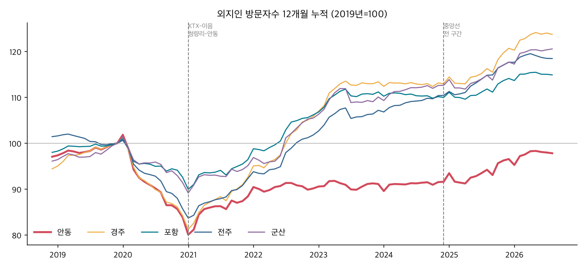
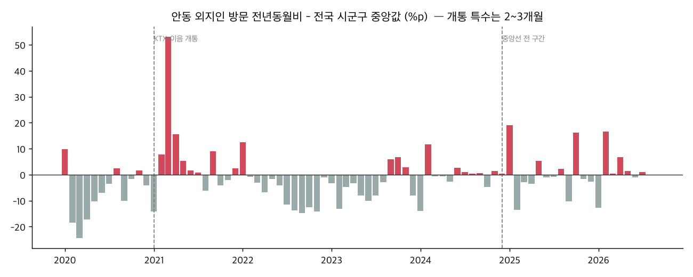
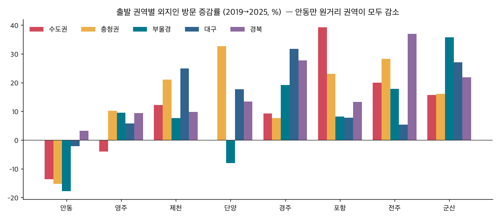
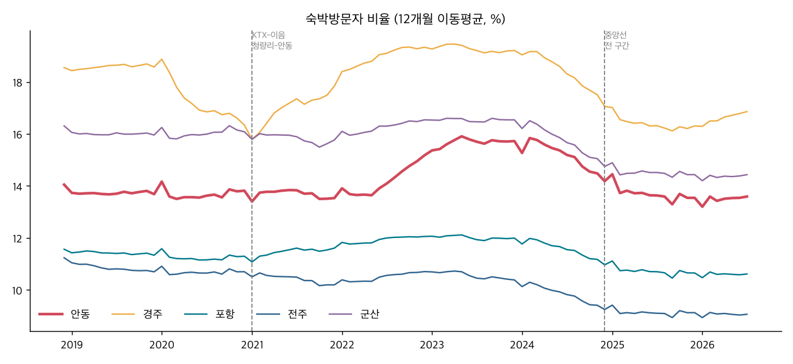
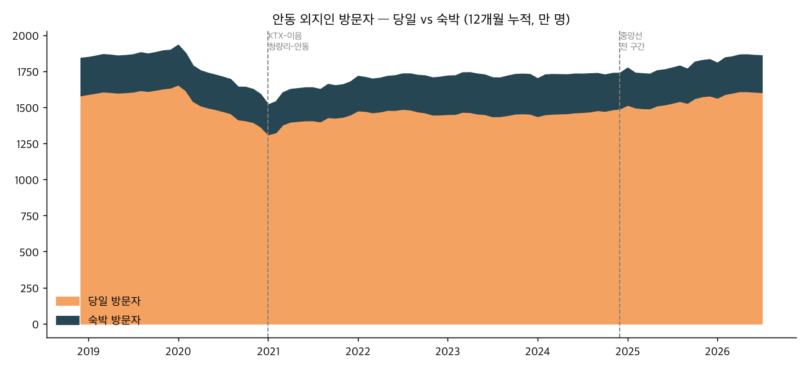
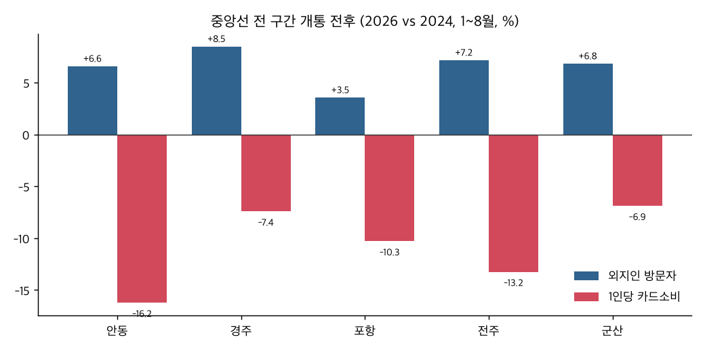
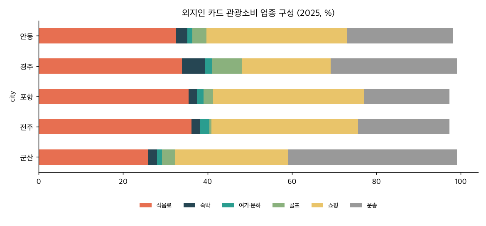
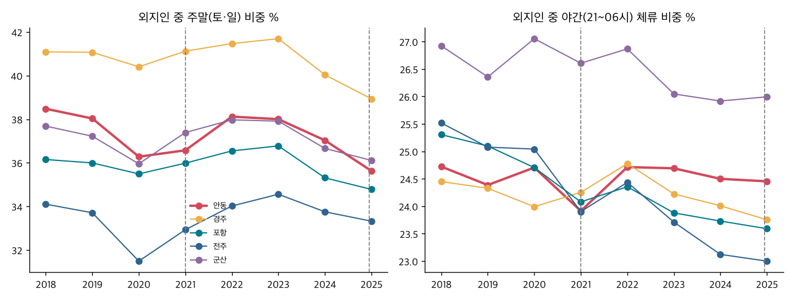

# 교통 호재(KTX-이음·중앙선 전 구간) 전후 안동 관광 변화 — 데이터 분석

> 2026-09-11 · 윤서 파트 (2) · 메인 안동(2018~2026.8), 비교 경주·포항·전주·군산 (+ 같은 노선의 영주·제천·단양·영천)
> 데이터: 한국관광 데이터랩 이동통신(KT)·신용카드(신한)·내비(T map) 로컬 수집본 + 유입지 분포는 **API로 기간별 재수집**(`data/api_region/유입지_기간별_LN_03_01_053.csv`) + 외부 기사
> 재현: `.venv_pdf/bin/python scripts/안동_교통호재_분석.py` → `scripts/안동_교통호재_추가차트.py`

> ⚠️ **2차 분석에서 정정됨 (`안동_교통호재_2차분석.md`)** — 아래 ①②의 "안동 외지인 감소"는 대부분 **풍산읍·용상동(비관광 지역)** 감소 때문이다. 안동 **관광권역 방문은 2019 대비 +16%** 로 늘었다. 확인된 핵심 문제는 **"방문은 늘었는데 소비가 따라오지 않는다"(⑤)** 이다.

---

## 0. 한 장 요약

| # | 발견 | 핵심 숫자 |
|---|---|---|
| ① | **KTX가 생겼는데도 안동 외지인 방문은 2019년 수준을 회복하지 못했다** | 2019=100 → 2023 **91.1** / 2025 **96.6**. 전국 시군구 중앙값 108.2 / 115.3. **2023년 전국 하위 2%** |
| ② | **KTX로 서울과 가까워졌는데 수도권 방문객은 오히려 줄었다** | 안동 수도권 출발 방문 **−13.7%**(2019→2025), 충청 −15.3%, 부울경 −17.8%. **비교 도시 8곳 중 원거리 권역이 전부 감소한 곳은 안동뿐** |
| ③ | 철도 이용객은 두 배가 됐다 → **철도는 새 수요를 만든 게 아니라 자동차 이용자를 옮겨 태웠을 가능성** | 안동역 일평균 484명 → 1,100명대. 그래도 외지인 방문의 약 2% 규모 |
| ④ | 개통 효과는 **2~3개월 반짝**하고 사라졌다 (두 번 모두) | 2021.3~4 전국 상위 6~10% → 8월 하위 19%. 2025.1 상위 13% → 2~4월 하위권 |
| ⑤ | 중앙선 전 구간 개통 뒤 **사람은 늘었는데 돈은 줄었다** | 2026년 1~8월(2024년 대비) 방문 **+6.6%**, 1인당 카드소비 **−16.2%**(5개 도시 중 최악), 총소비 −10.7% |
| ⑥ | 원래 가설인 "당일치기 가속화"는 **숙박비율 데이터로는 확인되지 않는다** | 안동 숙박비율 13.7%(2019) → 15.7%(2023) → 13.5%(2025). 전국 중앙값 대비 배율은 오히려 1.49 → 1.74로 상승 |

> **반전 인사이트 (수정안)**
> 원래 가설: "교통 접근성 개선이 오히려 당일치기를 가속화했다"
> 데이터가 말하는 것: **"교통 접근성은 획기적으로 좋아졌는데, 안동은 그걸 방문으로 바꾸지 못했다."**
> 철도 이용객은 2.3배가 됐지만 외지인 방문은 전국 하위 2~4%, 수도권 방문객은 −14%다.
> 문제는 '당일치기'가 아니라 **'접근성→방문 전환 실패(Access–Conversion Gap)'** 다.

---

## 1. 이벤트 타임라인 (외부 자료)

| 시점 | 내용 | 출처 |
|---|---|---|
| 2020.12.17 | 안동역을 운흥동(원도심)에서 **송현동(터미널 옆)으로 이전** | [경북일보](https://www.kyongbuk.co.kr/news/articleView.html?idxno=2062420&sc_sub_section_code=S2N27), [대구일보](http://www.idaegu.com/newsView/idg202012140093) |
| 2021.01.05 | **KTX-이음 청량리~안동 개통.** 무궁화 최장 3시간 54분 → **약 2시간** | [현대로템](https://blog.hyundai-rotem.co.kr/657), [부산일보](https://www.busan.com/view/busan/view.php?code=2020122819244418777) |
| 2024.12.20 | **중앙선 복선전철 전 구간 개통.** KTX-이음이 청량리~**부전**까지 연장(의성·경주·태화강 정차). 청량리~부전 3시간 56분 → 3시간 38분 | [코레일](https://info.korail.com/info/selectBbsNttView.do?key=911&bbsNo=199&nttNo=23918), [정책브리핑](https://www.korea.kr/news/policyNewsView.do?newsId=148956480) |
| 2025.12~ | 부전행 운행 확대로 **주말 하루 20회** 운행. 안동~영천 구간 신호 개량 | [경북일보](https://www.kyongbuk.co.kr/news/articleView.html?idxno=4069139), [부산일보](https://v.daum.net/v/zjmsf4WIY7) |

**철도 이용 실적** — 중앙선 KTX-이음(안동·영주 등) 일평균 이용객은 2021년 858명 → 2022년 1,178명 → 2023년 1,346명 → 2024년 1,475명 → 2025년 1,731명 → 2026년 1,974명(**2.3배**)이다. 안동역만 보면 개통 당시 484명에서 1,100~1,140명으로 늘었고, 5년 누적 이용객은 239만 명이다. ([매일신문](https://www.imaeil.com/page/view/2026040611161518896), [더팩트](https://news.tf.co.kr/read/national/2309353.htm), [헤럴드경제](https://biz.heraldcorp.com/article/10456298))

---

## 2. 방문 규모 — 안동만 회복하지 못했다

**외지인 방문자수 (이동통신, 만 명)**

| | 2018 | 2019 | 2020 | 2021 | 2022 | 2023 | 2024 | 2025 |
|---|---|---|---|---|---|---|---|---|
| **안동** | 1,841 | 1,897 | 1,590 | 1,677 | 1,710 | 1,729 | 1,738 | **1,832** |
| 경주 | 4,036 | 4,274 | 3,598 | 3,958 | 4,525 | 4,847 | 4,828 | 5,159 |
| 포항 | 5,482 | 5,593 | 5,177 | 5,394 | 5,938 | 6,219 | 6,151 | 6,383 |
| 전주 | 7,459 | 7,353 | 6,300 | 6,788 | 7,484 | 7,881 | 8,120 | 8,651 |
| 군산 | 2,273 | 2,365 | 2,162 | 2,249 | 2,494 | 2,604 | 2,664 | 2,784 |

**2019년=100 지수와 전국 백분위** (전국 시군구 약 250곳 가운데 위치)

| | 2021 | 2022 | 2023 | 2025 | 2023 전국 백분위 | 2025 전국 백분위 |
|---|---|---|---|---|---|---|
| **안동** | 88.4 | 90.1 | **91.1** | 96.6 | **하위 2%** | **하위 4%** |
| 경주 | 92.6 | 105.9 | 113.4 | 120.7 | 상위 30% | 상위 29% |
| 포항 | 96.4 | 106.2 | 111.2 | 114.1 | 63% | 45% |
| 전주 | 92.3 | 101.8 | 107.2 | 117.7 | 47% | 60% |
| 군산 | 95.1 | 105.5 | 110.1 | 117.7 | 57% | 60% |
| 전국 시군구 중앙값 | 94.4 | 103.7 | 108.2 | 115.3 | | |
| 경북 시군 중앙값 | 96.4 | 105.8 | 110.5 | 115.2 | | |

**같은 KTX-이음 노선의 다른 도시들 (2019=100)**

| | 2021 | 2023 | 2025 |
|---|---|---|---|
| **안동** | 88.4 | 91.1 | **96.6** |
| 영주 | 91.2 | 100.7 | 108.6 |
| 제천 | 93.2 | 114.1 | 117.3 |
| 단양 | 86.1 | 112.4 | 112.5 |
| 영천 | 96.8 | 112.0 | 118.1 |
| (참고) 문경·상주·예천 | | | 111~120 |

→ **"코로나 때문"도 "경북이 원래 약해서"도 아니다.** 같은 노선에 KTX가 선 영주·제천·단양은 모두 2019년을 넘었다. **안동만의 문제**다.
→ 교차검증: 이동통신 교차표(BDT_01_01_006)로 따로 합산해도 안동 외지인 지수는 2023년 90.3, 2025년 95.2로 같은 결과가 나온다. 반면 안동 **현지인** 지수는 2025년 108.0으로 늘었다. 도시 활동량이 줄어든 게 아니라 **바깥 사람이 덜 오는 것**이다.

### 개통 효과는 2~3개월짜리였다

| 월 | 안동 전년동월비 | 전국 중앙값 | 안동 백분위 |
|---|---|---|---|
| 2021.03 | +77.2% | +24.0% | **94** |
| 2021.04 | +21.9% | +6.4% | **90** |
| 2021.08 | −7.4% | −1.2% | 19 |
| 2021.10 | −5.5% | −1.4% | 21 |
| 2025.01 | +29.8% | +10.8% | **87** |
| 2025.02~04 | −24.2 / −2.4 / −2.8% | −10.7 / +0.4 / +0.6% | 15 / 22 / 24 |
| 2025.12 | +4.6% | +7.2% | 21 |
| 2026.01 | −15.8% | −3.2% | 12 |

→ 두 번의 개통 모두 **첫 1~3개월만 반짝**하고 그 뒤 전국 평균 아래로 돌아갔다. 새로 생긴 노선을 한 번 타 보는 신규성 수요에 그쳤고, 다시 오게 만드는 요소가 없었다는 뜻이다.

---

## 3. 누가 줄었나 — 원거리(수도권·충청·부울경) 방문객 이탈

> 데이터랩 '유입지 분포'(LN_03_01_053)를 **API로 연도별 재호출**해 출발 권역 구성비를 구하고, 여기에 연도별 방문자수를 곱해 권역별 방문 수를 추정했다.

**출발 권역별 외지인 방문 증감률 (2019→2025, %)**

| | 수도권 | 충청권 | 부울경 | 대구 | 경북 |
|---|---|---|---|---|---|
| **안동** | **−13.7** | **−15.3** | **−17.8** | −2.1 | +3.2 |
| 영주 (KTX-이음) | −4.0 | +10.1 | +9.5 | +5.8 | +9.4 |
| 제천 (KTX-이음) | +12.2 | +21.0 | +7.6 | +24.9 | +9.7 |
| 단양 (KTX-이음) | 0.0 | +32.6 | −8.1 | +17.6 | +13.4 |
| 경주 | +9.2 | +7.6 | +19.2 | +31.7 | +27.7 |
| 포항 | +39.2 | +23.0 | +8.2 | +7.7 | +13.3 |
| 전주 | +20.0 | +28.3 | +17.8 | +5.3 | +36.9 |
| 군산 | +15.7 | +16.1 | +35.8 | +27.1 | +21.8 |

**안동 외지인 출발 권역 구성비 추이 (%)**

| | 2018 | 2019 | 2021 | 2023 | 2024 | 2025 | 2024 1~8월 | 2025 1~8월 | 2026 1~8월 |
|---|---|---|---|---|---|---|---|---|---|
| 수도권 | 19.6 | 15.7 | **16.0** | 15.4 | 15.1 | **14.0** | 15.7 | 14.4 | 17.3 |
| 부울경 | 7.8 | 7.2 | 7.0 | 6.3 | 5.9 | 6.1 | 5.6 | 6.1 | 6.3 |
| 대구 | 12.3 | 11.2 | 10.6 | 11.1 | 12.1 | 11.4 | 11.9 | 10.7 | 11.3 |
| 경북 | 45.4 | 51.7 | 51.3 | 52.4 | 53.0 | **55.2** | 52.4 | 55.5 | 49.9 |
| 충청권 | 9.7 | 9.7 | 9.8 | 10.0 | 9.2 | 8.5 | 9.6 | 8.6 | 9.5 |

- **청량리 직결(2021) 뒤에도 수도권 비중은 15.7%에서 16.0%로 사실상 그대로**였고, 이후 14.0%까지 떨어졌다.
- **부산 직결(2024.12) 뒤 부울경 비중은 5.6%에서 6.3%로 +0.7%p 오르는 데 그쳤다.** 같은 기간 경주의 부울경 비중은 45.7%에서 43.5%였다.
- 2026년 1~8월에는 수도권 비중이 17.3%로 올랐지만, **경주(+3.4%p)·전주(+2.6%p)·군산(+5.3%p)도 같이 올랐다.** 전국적인 산출 방식 변화 가능성이 있어 안동만의 효과로 볼 수 없다.
- 안동 외지인의 **55%가 경북 안에서** 온다. 1위는 예천군이다(13.0% → 16.7%). **경북도청 신도시 생활권 이동**이 섞여 있다는 뜻이고, 순수 관광 방문은 표면 수치보다 더 약할 수 있다.

---

## 4. 당일 vs 숙박 — "당일치기 가속화" 가설 검증

**숙박방문자 비율 (%, 연평균)**

| | 2018 | 2019 | 2020 | 2021 | 2022 | 2023 | 2024 | 2025 | 2026(1~8월) |
|---|---|---|---|---|---|---|---|---|---|
| **안동** | 14.1 | 13.7 | 13.8 | 13.5 | 15.2 | **15.7** | 14.2 | 13.5 | 13.5 |
| 경주 | 18.6 | 18.6 | 16.3 | 17.8 | 19.3 | 19.2 | 17.1 | 16.3 | 16.9 |
| 포항 | 11.6 | 11.3 | 11.3 | 11.6 | 12.1 | 12.0 | 11.0 | 10.7 | 10.4 |
| 전주 | 11.2 | 10.7 | 10.7 | 10.2 | 10.7 | 10.4 | 9.3 | 9.1 | 8.9 |
| 군산 | 16.3 | 16.0 | 16.1 | 15.8 | 16.5 | 16.5 | 14.8 | 14.4 | 14.3 |
| 전국 시군구 중앙값 | 9.7 | 9.2 | 8.7 | 8.3 | 8.8 | 8.9 | 8.1 | 7.8 | 7.5 |

**당일 방문자와 숙박 방문자로 나눈 증감 (방문자수 × 숙박비율)**

| | 당일 2019→2023 | 숙박 2019→2023 | 당일 2019→2025 | 숙박 2019→2025 |
|---|---|---|---|---|
| **안동** | **−11.0%** | **+4.6%** | −3.4% | −4.0% |
| 경주 | +12.6% | +16.7% | +24.1% | +6.1% |
| 포항 | +10.4% | +17.4% | +15.0% | +7.7% |
| 전주 | +7.6% | +3.9% | +19.7% | +0.6% |
| 군산 | +9.3% | +14.1% | +19.8% | +7.0% |

**전체 방문자 중 1박 비중 (이동통신 숙박일수별, %)**: 안동 9.2(2019) → 10.5(2023) → 8.9(2025). 경주 14.0 → 13.9 → 11.5.

해석:
- KTX 개통 뒤(2021~2023) 안동에서 줄어든 쪽은 **당일 방문자(−11%)** 이고, 숙박 방문자는 오히려 늘었다(+4.6%). **"당일치기가 늘었다"는 가설과 반대**다.
- 2024년에는 모든 도시와 전국 중앙값에서 숙박비율이 함께 약 1%p 떨어졌다. 산출 기준 변화 가능성이 있다. 전국 대비 배율로 보면 안동은 1.49배(2019)에서 1.74배(2025)로 **오히려 개선**됐다.
- **다만 2024.12 이후는 경고 신호가 있다.** 2026년 1~8월 방문은 2024년보다 +6.6%(전국 중앙값 +5.6%)였는데, **1인당 카드소비는 −16.2%** 로 5개 도시 중 가장 크게 떨어졌다. "스쳐 지나가는 관광(Transit Tourism)"을 경계할 근거는 **숙박비율이 아니라 소비 쪽**에 있다.

---

## 5. 돈 — 1인당 소비와 업종 구조

**중앙선 전 구간 개통 전후 (1~8월 동기간)**

| | 방문 26/24 | 총소비 26/24 | 1인당 소비 2024 → 2026 | 1인당 26/24 | 숙박업 비중 2024 → 2026 |
|---|---|---|---|---|---|
| **안동** | +6.6% | **−10.7%** | 15,978 → 13,385원 | **−16.2%** | 1.86 → 3.02% |
| 경주 | +8.5% | +0.4% | 19,101 → 17,684원 | −7.4% | 7.13 → 5.52% |
| 포항 | +3.5% | −7.1% | 15,343 → 13,763원 | −10.3% | 2.05 → 1.61% |
| 전주 | +7.2% | −7.0% | 14,523 → 12,599원 | −13.2% | 1.78 → 1.94% |
| 군산 | +6.8% | −0.5% | 19,964 → 18,589원 | −6.9% | 2.49 → 1.89% |

→ 1인당 소비는 모든 도시에서 줄었다(전국적 소비 위축). 그 안에서도 **안동의 감소폭이 가장 크다.** 숙박업 비중만 올랐는데, 이는 총소비가 줄어든 영향이 크다.

**외지인 카드 관광소비 (억 원)**: 안동 2,535(2019) → 2,684(2022) → 2,721(2025)로 제자리다. 경주는 7,540 → 9,286(+23%).

**업종 구성 (2025, %)**

| | 숙박 | 식음료 | 여가·문화 | 골프 | 쇼핑 | 운송(주유 등) |
|---|---|---|---|---|---|---|
| **안동** | 2.65 | 32.6 | **1.12** | 3.4 | 33.3 | 25.2 |
| 경주 | **5.58** | 33.9 | 1.68 | 7.0 | 20.9 | 29.9 |
| 포항 | 1.94 | 35.5 | 1.61 | 2.2 | 35.7 | 20.3 |
| 전주 | 1.93 | 36.2 | **2.29** | 0.5 | 34.8 | 21.6 |
| 군산 | 2.22 | 25.9 | 1.15 | 3.1 | 26.7 | 40.0 |

- 안동 **문화서비스 비중은 0.23%** 로 박물관·공연·전시가 거의 없다. 호텔 0.07%, 기타숙박(모텔급) 2.52%다.
- **운송(육상운송=주유 중심) 25%** 가 차지한다는 건 방문이 **여전히 자동차 중심**이라는 뜻이다. 국민여행조사 기준으로도 국내여행의 **자가용 비율은 85.2%** 다 ([트래블데일리](https://www.traveldaily.co.kr/news/articleView.html?idxno=61488)).

**외지인 1인(방문)당 카드 관광소비 (원, 연간)**: 안동 13,364(2019) → 15,745(2023) → 14,853(2025). 경주는 17,640 → 19,363 → 18,001이다.

---

## 6. 누가 오나 — 요일·시간대·연령

| 지표 (안동) | 2019 | 2021 | 2023 | 2025 | 비교 도시 |
|---|---|---|---|---|---|
| 주말(토·일) 비중 | 38.0% | 36.6% | 38.0% | 35.6% | 5개 도시 모두 하락 (경주 41.1 → 38.9) |
| 금요일 비중 | 14.2% | 14.3% | 14.2% | 13.8% | 변화 없음 |
| 야간(21~06시) 체류 비중 | 24.4% | 23.9% | 24.7% | 24.5% | 안동만 유지 (전주 25.1 → 23.0) |
| **2030 비중** | 33.2% | 33.2% | 31.2% | **30.1%** | **5개 도시 중 최저** (경주 35.1, 전주 34.5) |
| **60대 이상 비중** | 16.2% | 19.7% | 23.2% | **25.5%** | 모든 도시에서 상승 |

- "KTX가 2030 수도권 청년을 데려온다"는 기대와 달리 **2030 비중은 계속 줄었다.** 외지인 연령 구성에서 20대는 18.7%에서 15.4%로 줄었고 60대는 11.4%에서 17.6%로 늘었다.
- 야간 체류 비중이 떨어지지 않았다는 점은 "당일치기 가속화" 가설에 대한 또 하나의 반증이다.

---

## 7. 어디로 가나 — 도시 안 이동과 라스트마일

**안동 외지인 방문 읍면동 상위 (이동통신, 전체 기간)**

| 순위 | 읍면동 | 비중 | 성격 |
|---|---|---|---|
| 1 | 중구동 | 12.3% | 원도심 |
| 2 | 풍산읍 | 12.0% | 도청 신도시 인접 |
| 3 | 옥동 | 9.7% | 신시가지·상권 |
| 4 | 서구동 | 9.2% | 원도심 |
| 5 | 용상동 | 8.6% | 주거·상권 |
| 6 | 풍천면 | 7.5% | **하회마을 + 도청 신도시** |
| 9 | 송하동 | 4.4% | **신 안동역·터미널** |
| 15 | **도산면** | **2.0%** | **도산서원** |

→ 외지인 활동은 **시가지와 업무 지역에 몰려 있다.** 세계유산이 있는 면 단위(도산면 2.0%, 와룡면 2.1%)로는 거의 흘러가지 않는다.

**역·시내 → 관광지 대중교통** ([안동 관광지 시내버스 시간표](https://www.tourandong.com/public/sub5/businfo.pdf), PDF에서 추출한 수치라 대략값)

| 관광지 | 버스 | 하루 운행 | 소요 |
|---|---|---|---|
| 하회마을·병산서원 | 246번 | 약 8~9회 (첫차 06:20) | **약 50분** |
| 도산서원 | 567번 | **약 4회** | 약 50분 |
| 월영교·안동댐·문화관광단지 | 3·3-1번 | 약 5~7회 | 약 30~40분 |

- 신 안동역은 원도심에서 벗어난 송현동 터미널 옆이다 ([나무위키: 안동역](https://namu.wiki/w/%EC%95%88%EB%8F%99%EC%97%AD)). KTX로 2시간이면 오지만 **역에서 하회마을까지 버스로 50분, 한 대 놓치면 1시간 이상 기다린다.**
- 안동시도 이 문제를 알고 있다. 2026년 6월 '워크스테이 in 안동'에서 뚜벅이 관광객 관점으로 대중교통 불편을 점검했고, 7월에는 외국인 관점, 8월에는 야간 원도심 체류로 이어 가고 있다. 상인 인터뷰에는 이런 말이 나온다: "볼거리는 많지만 **대중교통 정보가 부족해 오래 머무르지 못하는** 관광객이 적지 않다." ([경북일보](https://www.kyongbuk.co.kr/news/articleView.html?idxno=4075755), [매일신문](https://www.imaeil.com/page/view/2026070108472872557))
- **정량 만족도 자료는 공개된 게 없다.** 안동시 사회조사는 파일로만 배포되고([안동시](https://www.andong.go.kr/portal/contents.do?mId=0502060000)), 한국교통안전공단 '지역별 대중교통 서비스 만족도'([공공데이터포털](https://www.data.go.kr/data/15066827/fileData.do))가 대안이다. **다운로드 여부 확인 필요**
- DRT: 안동에서 관광용 수요응답형 교통을 도입했다는 공식 자료는 찾지 못했다. 국토부 「DRT 도입·운영 가이드라인」(2025.12)이 제도 근거다 ([스마트시티](https://smartcity.go.kr/wp-content/uploads/2026/01/251230_%EC%88%98%EC%9A%94%EC%9D%91%EB%8B%B5%ED%98%95%EA%B5%90%ED%86%B5-%EB%8F%84%EC%9E%85%EC%9A%B4%EC%98%81-%EA%B0%80%EC%9D%B4%EB%93%9C%EB%9D%BC%EC%9D%B8%EA%B5%AD%ED%86%A0%EA%B5%90%ED%86%B5%EB%B6%80.pdf)).

---

## 8. 기타 보조 지표

| 지표 | 안동 | 경주 | 포항 | 전주 | 군산 | 해석 |
|---|---|---|---|---|---|---|
| 내비 목적지 검색 2019 → 2025 | **+93%** | +58% | +92% | +67% | +54% | **관심(검색)은 가장 많이 늘었는데 방문은 안 늘었다** (T map 이용자 증가분 포함) |
| 외국인 방문자 2025 (만 명) | **26** | 139 | 97 | 72 | 102 | 외국인 시장은 사실상 없다 |
| 외국인 숙박관광객 2025 | 3.8만 | 26.5만 | 14.3만 | 13.0만 | 16.6만 | |
| 전체 기간 무박 비중 | 85.8% | 82.1% | 88.6% | 89.9% | 84.3% | 안동이 특별히 나쁘지는 않다 |

---

## 9. 주제 선정 제안

### 추천 A (가장 강력) — 「KTX는 왔는데, 관광객은 오지 않았다」
- **문제**: 철도 이용객은 2.3배인데 외지인 방문은 전국 하위 2~4%, 수도권·충청·부울경 방문은 −14~−18%다.
- **차별점**: 기존 "KTX 빨대효과" 담론은 사람을 빼앗긴다는 이야기다. 안동은 **빼앗긴 것도 얻은 것도 없다.** 즉 **전환 실패**다.
- **데이터 적합성**: 데이터랩 이동통신·유입지·카드만으로 전부 재현된다 (데이터 활용도 30점).
- **통제군**: 같은 노선의 영주·제천·단양, 5개 비교 도시, 전국 시군구 250곳. 이중차분(DiD) 구조를 발표에서 그대로 보여 줄 수 있다.

### 추천 B (A의 원인 → 처방) — 「역에서 멈춘 여행: 라스트마일 단절」
- **원인 가설**: 역(송현동)에서 세계유산(하회 50분, 도산서원 하루 4회)으로 가는 연결이 끊겨 있다. 뚜벅이는 오기 어렵고, 자동차 여행자는 원래 오던 사람들이다.
- **근거**: 외지인 활동이 시가지에 집중(도산면 2.0%), 운송 소비의 대부분이 주유, 개통 효과는 2~3개월 만에 소멸, 시가 스스로 워크스테이로 불편을 인정했다.
- **처방 방향**: KTX 도착 시간에 맞춘 **관광 DRT·셔틀**, 레일+숙박+셔틀 **체류 패키지**. 효과 지표는 '역 도착 → 관광지 도달률'과 '1인당 소비'.
- **보완 필요**: 역 기준 관광객 이동 경로 데이터(교통카드 빅데이터 [stcis.go.kr](https://stcis.go.kr/wps/dashBoard.do)의 안동역 정류장 승하차)가 있으면 결정적이다.

### 추천 C (모니터링형) — 「사람은 늘고 지갑은 닫혔다」
- 2024.12 부산 직결 뒤 방문 +6.6%, 1인당 소비 −16.2%(5개 도시 중 최악)다. Transit Tourism 가설의 **유일한 데이터 근거**다.
- 다만 개통 후 20개월밖에 안 됐고 전국적인 소비 위축과 겹친다. 단독 주제로 쓰기보다 **A·B의 '지금 막지 않으면' 근거**로 쓰는 게 좋다.

> **권장 조합: A(문제) + B(원인·처방) + C(긴급성)**
> 원래 가설의 "당일치기 가속화"는 데이터로 기각되니 **발표에서 가설→검증→반전 구조로 활용**하면 된다. "우리도 당일치기가 문제일 줄 알았다. 데이터를 보니 더 심각했다. 아예 안 온다."

---

## 10. 데이터 주의사항

| 항목 | 내용 |
|---|---|
| 외지인 정의 | 이동통신 '외지인'은 해당 시군구 비거주자의 방문이다. **출장·통근·생활권 이동이 포함**된다 (안동은 도청 신도시·예천 생활권 영향이 큼) |
| 포항·전주 합산 | 구 단위를 합산했으므로 구끼리 오간 이동이 이중계상될 수 있다. **규모보다 변화율로 해석** |
| 2024 숙박비율 | 전 지역에서 동반 하락 → 산출 기준 변화 가능성. 도시 간 **상대 비교**로만 해석 |
| 2026 유입지 | 모든 도시에서 수도권 비중이 동반 상승 → 산출 방식 변화 가능성 |
| 카드 소비 | 오프라인 결제 중심. **OTA 사전결제 숙박은 누락** → 숙박 비중은 과소계상 |
| 1인당 소비 | 카드 관광소비 ÷ 외지인 방문 수 (방문 1회당, 실제 1인당 지출 아님) |
| **로컬 파일 결함** | `api_region/월별_방문자수_현지인_LN_03_01_002.csv`는 **외지인 파일과 100% 동일**하다 (API가 touDivCd를 무시). 현지인은 교차표(BDT_01_01_006)를 쓸 것. `검색_중분류별_LN_03_01_065.csv`는 **모든 시군구 값이 같아서 무효** |
| 철도 수치 | 기사 인용값이다 (코레일 원자료 아님). '이용객' 정의(승차/승하차)는 확인 필요 |
| 버스 시간표 | PDF 텍스트 추출값이라 운행 횟수는 대략값이다. 원본 확인 권장 |

## 산출 파일
`보고서/안동교통/` — 표 CSV 약 35개(01~23번), 차트 PNG 9개(c1~c9)
