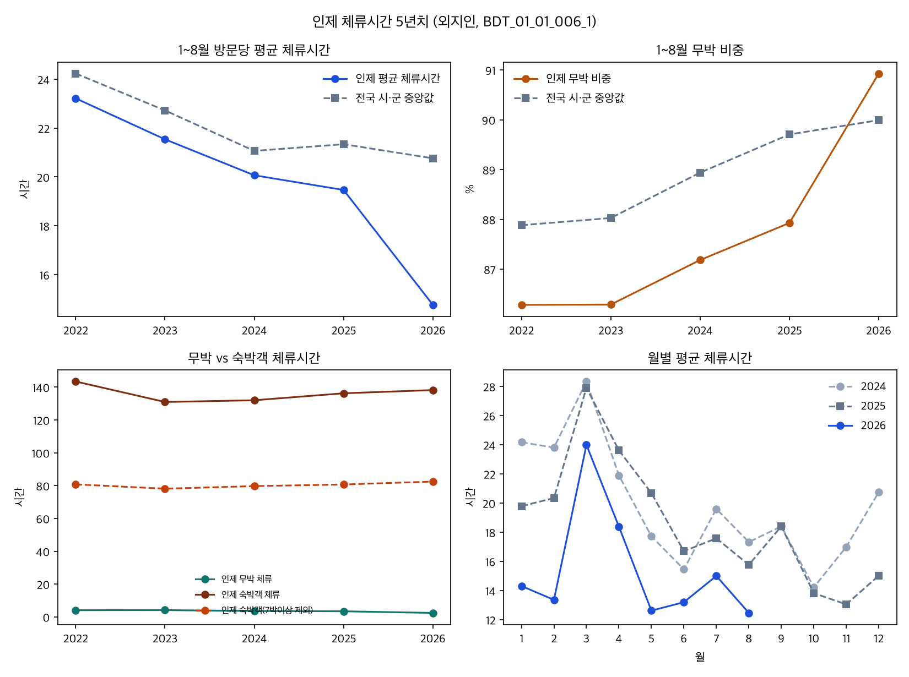

# 인제 체류시간 5년치 (2022~2026, 1~8월)

조사일: 2026-09-17. 범위: 외지인(b), 숙박일수별 체류시간 `BDT_01_01_006_1` + 2026년 8월 추가분. 비교 기간은 **1~8월**. 2026년 연간은 아직 8월까지다.

## 판단

인제 방문 급증은 숙박객이 늘어서가 아니라 **짧은 무박 방문이 분모를 키운 결과**에 가깝다. 2025→2026 1~8월 방문 +39.1% 중 **98.6%가 무박**이다. 같은 기간 방문당 평균 체류시간은 **19.5시간 → 14.8시간(−24.2%)**. 전국 시·군 중앙값은 21.3→20.8시간(−2.7%)이라 인제만 급락했다.

숙박객 체류시간은 줄지 않았다(136→138시간). 1박·2박 체류시간도 거의 같다. 줄어든 것은 **무박 비중**과 **무박 1회당 체류시간**(3.43→2.45시간, −28.7%)이다. ‘머무는 사람이 더 짧게 잔다’가 아니라 ‘스쳐 가는 방문이 늘고, 그 방문의 체류도 더 짧아졌다’.

이 자료만으로 ‘자작나무숲·백담사를 보고 바로 나간다’거나 ‘KTX 당일치기’로 단정하지 않는다. 통신 집계의 방문은 관광·통과·업무·군 관련 이동이 섞인다. 다만 방문당 소비 하락(−19.8%)과 같은 방향으로, **구성 변화 가설을 기각하지는 못한다.**

## 5년 요약 (1~8월, 외지인)

| 연도 | 방문(만) | 평균 체류(시간) | 전국 중앙 | 순위(짧음) | 무박 비중 | 전국 중앙 | 무박 체류(시간) | 숙박객 체류 | 숙박객 비중 |
|---|---:|---:|---:|---:|---:|---:|---:|---:|---:|
| 2022 | 503.2 | 23.2 | 24.2 | 62/136 | 86.3% | 87.9% | 4.10 | 143.5 | 13.7% |
| 2023 | 493.2 | 21.5 | 22.7 | 55/136 | 86.3% | 88.0% | 4.15 | 131.0 | 13.7% |
| 2024 | 479.6 | 20.1 | 21.1 | 58/136 | 87.2% | 88.9% | 3.61 | 132.0 | 12.8% |
| 2025 | 501.3 | 19.5 | 21.3 | 50/136 | 87.9% | 89.7% | 3.43 | 136.3 | 12.1% |
| 2026 | 697.3 | **14.8** | 20.8 | **18/136** | **90.9%** | 90.0% | **2.45** | 138.2 | **9.1%** |

2022→2026 평균 체류 **−36.4%**. 2025→2026 한 해에 −24.2%가 몰렸다. 2026년 값은 시·군 136곳 하위 25% 경계(16.5시간)보다도 짧다.

## 무엇이 평균을 깎았나 (2025→2026)

방문당 평균 체류 = (무박 비중 × 무박 체류) + (숙박 비중 × 숙박객 체류).

| 항목 | 2025 | 2026 | 변화 |
|---|---:|---:|---:|
| 방문 | 501.3만 | 697.3만 | +39.1% |
| 무박 방문 | 440.8만 | 634.1만 | +43.8% |
| 숙박 방문 | 60.5만 | 63.2만 | **+4.5%** |
| 1박 | 38.8만 | 40.6만 | +4.7% |
| 2박 | 13.8만 | 14.1만 | +2.3% |
| 평균 체류 | 19.47시간 | 14.76시간 | −4.70시간 |

증가분 195.96만 명 중 무박 193.23만(98.6%). 숙박객 수는 줄지 않았다. 숙박 비중이 12.1%→9.1%로 낮아진 것은 **분모 팽창**.

같은 분해로 평균 체류 −4.70시간 중:

- **구성(무박 비중 증가): −3.99시간, 84.7%**
- **체류 강도: −0.72시간, 15.3%** — 거의 전부 무박 체류 단축(3.43→2.45). 숙박객 체류는 오히려 +1.4%.

추가 방문 1명당 체류시간 기여는 **2.73시간**. 2026 무박 평균(2.45시간)과 같다. 늘어난 사람은 숙박 패턴이 아니라 짧은 무박 패턴이다.

숙박일수별 1회 체류시간은 안정적이다. 1박 34.7→34.9시간, 2박 59.4→61.5시간, 7박이상 ≈2,000시간. 2026년의 평균 하락은 구간 내부가 아니라 **무박으로의 이동 + 무박의 단축**.

월별로도 예외가 없다. 2026년 1~8월 모든 달에서 무박 체류가 2025년보다 짧고, 무박 비중이 높다. 5월 평균 체류 20.7→12.6시간, 1월 19.8→14.3시간이 두드러진다.

## 전국·인근과 비교

2026년 1~8월 인근 11곳 중 평균 체류가 가장 짧은 곳이 인제다. 2025→2026 하락폭도 인제 −24.2%가 혼자 크다. 다음이 영월 −13.0%, 나머지는 −5% 안팎이거나 보합이다.

| 지역 | 평균 체류 2025 | 2026 | 증감 | 무박 체류 2026 | 무박 비중 2026 |
|---|---:|---:|---:|---:|---:|
| 인제 | 19.5 | 14.8 | **−24.2%** | **2.45** | **90.9%** |
| 홍천 | 15.9 | 15.5 | −2.4% | 3.57 | 85.3% |
| 가평 | 16.4 | 15.7 | −4.2% | 4.53 | 80.7% |
| 양양 | 17.0 | 16.9 | −1.0% | 4.36 | 78.6% |
| 속초 | 19.5 | 18.7 | −4.1% | 4.81 | 75.4% |
| 영월 | 23.1 | 20.1 | −13.0% | 4.20 | 83.0% |
| 평창 | 22.7 | 21.9 | −3.2% | 4.44 | 78.9% |
| 춘천 | 33.7 | 32.1 | −4.7% | 4.27 | 84.4% |

홍천도 평균 체류는 짧지만, 무박 체류 3.57시간·무박 비중 85%로 인제와 결이 다르다. 인제 무박 2.45시간은 전국 중앙 3.30시간, 하위 25% 경계 2.90시간보다 짧다(기초단체 전체 250곳 기준 짧은 쪽 42위).

## 숙박비율·평균숙박일수 (데이터랩 LN, 별도 지표)

시군구 월별 숙박비율·평균숙박일수(`LN_02_01_013`). 체류시간 파일과 모집단이 다르다. **2026년은 1~7월만** 있다.

| 연도 | 1~7월 숙박비율 월평균 | 전국 시·군 중앙(1~8월) | 평균숙박일수(1~7월) |
|---|---:|---:|---:|
| 2022 | 13.0% | 12.2% | 3.34 |
| 2024 | 12.4% | 11.2% | 3.61 |
| 2025 | 11.5% | 10.4% | 3.82 |
| 2026 | **8.7%** | 10.1% | 3.70 |

숙박비율은 2026년 1~7월에 뚜렷이 떨어진다. 평균숙박일수는 숙박한 사람 기준이라 크게 줄지 않았다. 체류시간 파일의 숙박객 비중 하락과 같은 방향이다.

## 쓰지 말아야 할 해석

- **‘숙박객이 더 짧게 잔다’** — 숙박객 체류 +1.4%, 1박·2박 체류시간 유지. 7박이상 제외해도 80.7→82.5시간.
- **‘체류가 줄어서 방문당 소비가 줄었다’** — 전국 모형에서 숙박객 체류시간과 방문당 소비는 무관했다. 여기서 보인 것은 평균 체류 하락이지, 소비 인과가 아니다. 다만 같은 해의 방문 증가가 짧은 무박에 실려 있다는 점은 방문당 소비 하락과 **양립**한다.
- **숙박객 평균 체류 138시간을 ‘관광 5~6일’로 읽기** — 7박이상이 숙박객의 2.9%인데 숙박 체류시간 합의 **42%**. 7박이상 1인당 ≈2,008시간(약 84일)은 전국 공통(중앙 ≈2,027시간)이라 장기체류·생활권 혼입으로 본다. 관광 숙박 길이는 1박(35시간)·2박(61시간) 또는 7박제외(82시간)를 쓴다.
- **이 파일의 ‘관광객수’를 방문 연인원 정본과 더하기** — 2024~2026 1~8월 값은 방문자수 교차표(`BDT_01_01_006`)의 83~87%. 숙박일수 분해용이다. 방문·소비 본 분석은 기존 교차표를 유지한다.
- **BDT의 ‘숙박자수’ 열** — 월별 상수에 가깝고 쓰지 않는다.

## 기존 인제 가설과의 관계

방문 +33~38%인데 방문당 소비 −20%인 이유 후보 중, **‘더 짧은 방문이 분모를 키웠다’는 체류 쪽 근거가 생겼다.** 숙박 상품이 무너졌다는 근거는 이 자료에서 약하다. 다음 확인은 거점(자작나무숲·백담사 등) 단위 체류·검색·업종이 같은 방향으로 짧아지는지다. 군·통과 방문이 주원인이면 관광전환 주제는 중단한다.

원자료·재현: `analyze.py`, `인제_5년_1-8월_체류요약.csv`, `인제_1-8월_체류.csv`, `인제_월별_체류.csv`.
