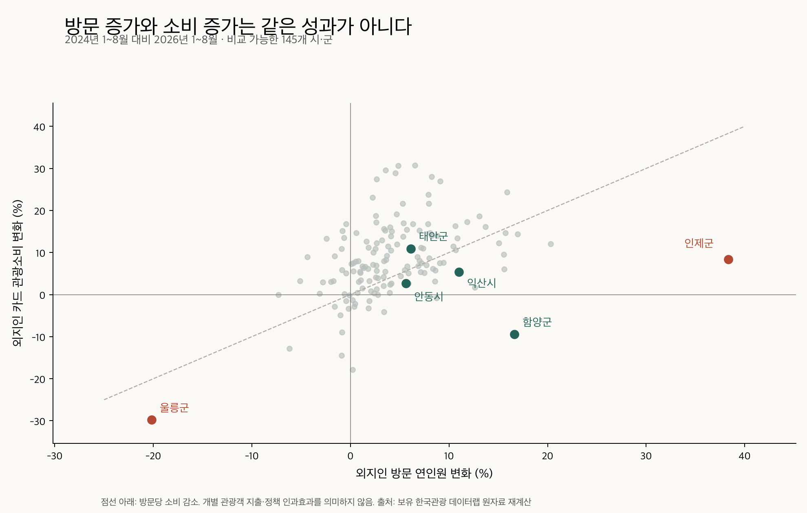

# 안동을 전제로 하지 않는 지역·주제 재선정

조사일: 2026-09-17. 목적: 한국관광 데이터랩 활용 경진대회에서 다룰 **지역 × 구체적 문제 × 개입 수단** 재선정.

## 1. 판단

**데이터상 우선 심층조사 대상은 인제, 운영 문제를 좁혀 실행안을 만들기 좋은 대안은 익산이다.** 주제를 완전히 바꾸려면 태안의 계절별 관광 지원예산 배분을 검토할 수 있다. 안동의 숙박·체류 릴레이를 다른 지역으로 옮기는 방식은 권하지 않는다.

이번 우선순위는 전국 최악 순위가 아니다. 보유 데이터의 이상 신호, 현재도 지속되는지, 기존 사업과의 중복, 개선 수단의 구체성, 마감 전 검증 가능성을 함께 판단했다. 원인이 입증되지 않은 후보를 확정 사업으로 표현하지 않았다.

| 우선도 | 지역 | 연구할 문제 | 개선의 단위 | 가장 중요한 미확인 사항 |
|---|---|---|---|---|
| 1 | 인제 | 방문 급증에도 유료 체험·지역 소비가 비례해 늘지 않는 이유 | 한 관광거점에서 다음 유료 활동으로의 전환 | 방문 증가가 관광객 구성 변화인지, 실제 이동·상품 연결 부족인지 |
| 2 | 익산 | 시티투어 이용 감소와 모집·운행 방식의 적합성 | 노선·시간·최소 출발인원 | 예약·취소·탑승 원자료 확보 |
| 3 | 태안 | 계절에 집중된 관광 수요에 맞지 않는 지원·홍보 예산 배분 가능성 | 지원하는 달·요일·상품 | 비수기의 판매 가능한 공급과 잠재 수요 |
| 조건부 | 함양 | 산악 인증 보상이 하산 후 지역 구매로 이어지는 과정 | 하산 지점·시간과 사용 가능한 가맹점 연결 | 기존 보상의 실제 사용·추가 지출, 카드 밖 상품권 소비 |
| 보류 | 울릉 | 방문과 소비의 동반 위축 | 예약 취소·운항 불확실성·여행 총비용 | 운항·결항·예약·가격 자료 |
| 보류 | 춘천마임축제 | 축제 방문 증가와 관측 카드소비 감소의 불일치 | 공연 전후 상권 이용 및 성과 측정 범위 | 동시행사·공간·결제 수단의 비교 가능성 |

## 2. 분석 범위와 방법

- 전국 시·군 중 **2024·2026년 각각 1~8월 방문과 외지인 카드소비가 모두 있는 145곳**을 원자료에서 재계산했다. 전국 모든 지자체를 포괄한 것은 아니다. 구 단위와 이름 중복 지역은 제외했다.
- 이전 66곳 분석의 ‘숙박객 비중 10% 이상’ 조건을 없앴다. 그 조건은 처음부터 숙박 주제에 유리하고, 함양 같은 후보를 놓칠 수 있다. 축제 보유 가점이나 임의의 잠재 개선액을 합쳐 종합점수를 만들지도 않았다.
- 방문 연인원은 `BDT_01_01_006_연도.csv`의 외지인·시간대가 있는 행만 합산했다. 요일별 행을 함께 더하지 않았다. 카드소비는 `touDiv1` 파일의 중복행을 제거하고 관광총소비를 사용했다. 금액 원단위 환산은 천 원 × 1,000.
- **방문당 소비 = 외지인 카드 관광소비 ÷ 외지인 방문 연인원**. 동일 개인의 지출액·구매전환율이 아니다. 통신·카드 모집단이 다르고 지역 밖 온라인 결제, 상품권, 추정모형의 영향을 받을 수 있다.
- 2025년 1~8월을 중간에 넣어 회복 중인 지역과 2년 연속 악화 지역을 구별했다. 2025년은 별도의 2019·2020·2025 파일에서 가져왔다.
- 2025년 12개월이 있는 146곳은 상위 3개월 방문·소비 비중을 계산했다. **2024년 소비 파일은 1~8월만 있어 계절성의 연속성은 이번 분석으로 검증하지 못했다.** 계절집중도만으로 초과 혼잡이나 경영 위기를 판정하지 않는다.
- 축제는 2024·2025년 짝이 있는 56개를 비교했다. 축제 데이터는 행사장 행정동·개최기간 기준이며 실제 입장객·축제 운영사 매출과 다르다. 개최일수가 다른 경우 일평균도 계산했다.
- 이전 M1과 공통인 145곳의 증감률은 최대 약 2.5×10⁻¹⁴%p 차이로 재현됐다. 이전 146곳 중 화성시는 이번 결합에서 제외됐으며 행정구역·명칭 일관성 확인 전 수치를 채워 넣지 않았다.

## 3. 같은 데이터도 기준 기간을 바꾸면 결론이 달라진다

모두 1~8월 비교. 소비는 명목 카드소비. 단위 %.

| 지역 | 방문 24→26 | 총소비 24→26 | 방문당 소비 24→26 | 방문당 소비 24→25 | 방문당 소비 25→26 |
|---|---:|---:|---:|---:|---:|
| 인제 | +38.3 | +8.3 | **−21.7** | −2.4 | **−19.8** |
| 익산 | +11.0 | +5.4 | −5.1 | −14.2 | **+10.7** |
| 함양 | +16.6 | −9.4 | −22.4 | −29.3 | **+9.9** |
| 안동 | +5.6 | +2.7 | −2.8 | −7.0 | **+4.5** |
| 울릉 | −20.2 | −29.8 | −12.1 | −8.3 | **−4.1** |
| 태안 | +6.1 | +10.9 | +4.5 | −4.1 | **+9.0** |

145곳의 방문당 소비 변화 중앙값은 24→26 **+4.1%**. 방문은 늘지만 방문당 소비는 감소한 곳은 **41곳**이다. 단일 문제로 안동만 특정하기 어렵다.

2년 연속 방문당 소비가 감소한 곳은 인제·울릉·군위·음성·진도 5곳이었다. 이것만으로 관광정책 실패를 뜻하지 않는다. 산업·생활방문이 섞이는 지역과 행정구역 변화 지역은 별도 검증이 필요하다.

## 4. 1순위: 인제 — 방문 증가의 다음 단계를 설계한다

### 확인된 사실

- 24→26 방문 +38.3%, 카드소비 +8.3%, 방문당 소비 −21.7%. 25→26에도 방문 +33.3%, 소비 +7.0%, 방문당 소비 −19.8%.
- 육상운송을 제외해도 24→26 방문당 소비는 **−22.5%**여서 해당 업종 하나의 영향으로 사라지는 신호는 아니다.
- 24→26 업종별 소비: 일반외식 +11.6%, 제과음료 +5.2%, **기타레저 −19.7%, 문화서비스 −55.6%**. 관광유원시설은 +132.6%지만 작은 기저다. ‘모든 체험업종 침체’라고 하면 틀린다.
- 2025년 방문 상위 3개월(10·8·7월)이 연간 방문의 **37.6%**, 146곳 중앙값은 30.1%. 어느 계절·어느 거점에 개입할지 나눌 필요가 있다.
- 2026년 방문 증가와 관광거점 이용 증가는 지역 보도에서도 관찰된다. 다만 기사상 1~7월 623만9,591명과 보유 원자료 합계 644만8,282명이 일치하지 않는다. 추출 시점·집계 정의 차이는 미확인으로 남긴다. 기사를 숫자의 독립 검증으로 쓰지 않는다. [강원일보 보도, 2026-08-18](https://v.daum.net/v/20260818200025154)

### 제안하는 문제 정의

**“관광거점 방문 증가가 주변 유료 체험·상점의 이용 증가로 충분히 이어지는가? 끊긴다면 어느 거점, 어느 방문 유형, 어느 시간인가?”**

‘인제에는 콘텐츠가 없다’, ‘모두 통과한다’, ‘KTX 때문에 당일치기가 늘었다’는 결론은 현재 자료로 낼 수 없다. 총액도 증가했다. 방문 구성 변화만으로도 비율은 낮아질 수 있다.

### 개선안

**한 거점에서 출발하는 ‘예약 가능한 다음 활동’ 운영안**을 만든다. 백담사·자작나무숲·모터스포츠 거점을 한 번에 묶지 말고, 수요 증가와 주변 공급이 확인되는 한 곳을 선정한다.

1. 방문객의 활동 종료시간, 실제 귀가 예정, 동반자, 이동수단을 구분한다.
2. 이동 가능 시간 안에 있고 실제 자리가 있는 유료 체험·식사만 제시한다.
3. 예약 시간·이동·영업시간이 맞지 않으면 안내 개선, 운영시간 조정, 소규모 이동 연계 중 실제 장애에 맞는 수단을 고른다.
4. 기존 상품권 사업과 중복되는 할인은 뒤로 둔다. 인제군의회 검색자료에도 자작나무숲 상품권 운영 논의가 있어 ‘최초의 상품권 연계’로 주장하지 않는다. [인제군의회 2026-07-28 회의록](https://www.injecl.go.kr/mnts/cms/svc/mntsViewer.php?schSn=2185)

### 필요한 추가 분석과 선정 중단 조건

읍면동·관광지 방문 및 내비 검색, 방문 성·연령·요일·시간대, 체험업체 영업·예약 현황을 맞춰 본다. 군·생활·업무 방문 증가가 주원인이거나, 관광거점에서는 문제가 재현되지 않으면 이 관광전환 주제를 중단한다. 통신 집계만으로 개인 이동 경로를 만들지 않는다.

산출물은 **거점별 이탈 구간 지도 + 실제 판매 가능한 반일 일정 + 업체 운영 수정표**. 성과는 안내 대상자 전체 중 추가 유료 활동 구매율, 추가 체류시간, 할인·운영비를 뺀 추가 매출로 측정한다. 클릭·의향은 실제 구매와 분리한다.

## 5. 2순위: 익산 — 관광객 부족보다 시티투어 운영을 바꾼다

익산은 방문당 소비가 2024년보다 낮지만 2026년 전년 대비 **+10.7% 회복**했다. 따라서 ‘관광소비가 계속 추락하는 도시’라는 문제 정의는 부적절하다.

대신 2026-07-21 시의회에서 구체적인 운영 문제가 확인된다. 순환형 운행 증가에도 이용객 감소가 지적됐고, 테마형 최소 모집인원은 15명에서 20명으로 바뀌었다. 담당 부서는 선거 관련 행사 축소와 학생 투어의 별도 사업 전환도 설명했다. **최소 인원 변경만을 감소 원인으로 단정할 수 없다.** [익산시의회 제279회 제4차 회의록](https://councilvod.iksan.go.kr/cast/viewer/record.do?key=fcb914dc022fd67a8709190eec74ad49cb52d2516d6c44e40e9d0d361f7a34c54e0a7578a3c8e03a&pos=4593)

- **문제:** ‘수요가 있는 시간·인원·관광지 조합과 투어의 출발 조건이 맞는가?’
- **개선:** 예약·미출발 건을 분석해 저수요 시간 운행을 줄이고 필요한 시간에 배치한다. 20명 미달 취소가 실제로 많고 비용 대비 성과가 좋다면 소형 차량, 회차 합류, 출발 보장일 등 대안을 비교한다. 무조건 증차하거나 전면 소형화하지 않는다.
- **데이터:** 데이터랩의 방문 시간·요일·목적지 검색 + 실제 예약 인원·취소 사유·운행·탑승·비용. 현재 예약 시스템은 운영 중이다. [익산 통합예약](https://www.iksan.go.kr/reserve/)
- **산출물:** 기존안/변경안 노선·시간표와 비용 비교표. 공개 교통시간·현장 이동으로 이용 가능성을 점검한다.
- **성과:** 관광 목적 실제 탑승자당 운영비, 미출발률, 관광지 이용과 지역 구매율. 학생 동원으로 탑승자만 늘리는 성과는 분리한다.
- **제약:** 예약·탑승 자료가 없으면 데이터랩만으로 노선 효율을 입증할 수 없다. 이 경우 1순위로 올리지 않는다.

## 6. 다른 주제: 태안 — ‘몇 명 더 오게 할까’보다 ‘언제 지원할까’

태안의 24→26 방문당 소비는 **+4.5%**이고 25→26에도 +9.0%다. 소비 부진 도시로 선택할 근거는 약하다.

그러나 2025년 상위 3개월 방문 비중 **35.1%**, 소비 비중 **37.1%**는 중앙값(30.1%, 29.7%)보다 높다. 특히 방문 상위는 **10·8·5월**이다. 자료를 보기 전 ‘여름 해수욕장 편중’으로 규정하면 놓치는 점이다.

- **문제 가설:** 수요가 이미 높은 달에도 지원하고, 관광상품을 팔 수 있는 한산한 시기에는 지원이 부족한가?
- **개선:** 월·요일별 방문·소비·공급을 기준으로 홍보·할인 집행 달을 재배치한다. 축제 일정을 옮기거나 겨울 수요를 무조건 만들기보다, 영업 중인 숙소·체험이 있고 방문 가능성이 확인된 비수기 구간부터 시험한다.
- **산출물:** ‘지역 × 월 × 상품’ 지원 우선순위표와 동일 예산 배분 시나리오. 월별 예산·판매 가능 객실·기상·휴무 자료를 추가해야 한다.
- **성과:** 지원비당 순증 유료 예약·추가 매출. 성수기 예약을 단지 옮긴 효과와 새로운 방문을 구분한다.
- **한계:** 현재는 한 해의 집중도다. 고정비 부담·객실 가동률·예산 비효율은 아직 측정하지 않았다. 여러 해의 계절성 확인 전 확정하지 않는다.

## 7. 강한 숫자가 있어도 우선순위를 낮춘 후보

### 함양: 산악관광 보상의 지역 구매 전환

24→26 방문당 소비 −22.4%만 보면 가장 심각해 보인다. 하지만 총소비 감소에서 육상운송 감소가 **54.3억 원**, 전체 감소는 **49.2억 원**이다. 육상운송 제외 소비는 오히려 **+1.9%**, 일반외식 +3.9%, 제과음료 +7.6%. 2026년은 전년보다 방문당 소비 +9.9% 회복했다.

‘등산객이 지역경제를 망친다’는 해석은 불가하다. 대신 기존 산악 프로그램에서 **보상이 하산 후 실제 구매로 연결되는 과정**을 좁혀 볼 수 있다. 숙박 지원·상품권 환급은 이미 있다. [경남교육청 덕유학생교육원 공식 연계 안내](https://dy.gne.go.kr/dy/cm/cntnts/cntntsView.do?cntntsId=10161&mi=20327)

개선안은 새 보상앱이 아니라 하산 지점·시간에 맞는 영업 가맹점 안내와 주문·이동 연결. 보상 사용률과 본인 추가 결제를 측정한다. 기존 지원사업 효과를 카드통계만으로 판단하면 상품권 지출을 놓칠 수 있다. 실제 미사용·불편이 해결된 상태라면 주제를 버린다.

### 울릉: 수요 회복과 여행 불확실성

24→26 방문 −20.2%, 소비 −29.8%. 25→26에도 방문 −20.2%, 소비 −23.5%. 방문당 소비도 2년 연속 감소했다. 음식·쇼핑·숙박 등 여러 업종의 감소가 있어 특정 업종 하나의 문제는 아니다.

2026년 1~8월 관광객 감소는 군 집계를 인용한 연합뉴스에서도 확인된다. 기사는 군이 해외여행 증가·여객선 운항 중단 등을 이유로 본다고 전하며 물가 논란도 다룬다. 이는 원인별 기여도를 검증한 분석은 아니다. 군 관광객 집계와 통신 연인원은 서로 합치지 않는다. [연합뉴스 2026-09-02](https://www.yna.co.kr/amp/view/AKR20260902123300053)

후보 해법은 운항 가능 일정과 숙소를 연동한 예약 안내, 결항 시 변경 가능한 상품, 비교 가능한 여행 총비용 안내. 결항·예약취소·가격 데이터 없이 ‘바가지 때문에 감소’나 ‘날씨 때문에 감소’로 결론내리지 않는다. 주제는 분명하지만 팀이 개입할 범위와 검증 난도가 커 보류한다.

### 춘천마임축제: 축제 성과 측정과 상권 연계

2024→2025 동일 8일간 외지인 방문 +15.8%, 관측 외지인 카드소비 −29.1%, 방문당 소비 −38.8%. 공간·결제 범위가 같다면 조사 가치가 높다.

그러나 2024년 같은 시기 레고랜드 주차장 등에서 문화도시 박람회가 함께 열렸다. 기저 소비에 다른 행사 효과가 섞였을 가능성이 있다. 축제도 여러 장소에서 진행된다. [문화도시 박람회 보도](https://mstoday.co.kr/news/articleView.html?idxno=91529), [2025 축제 주최 측 발표](https://www.newswire.co.kr/newsRead.php?no=1011490)

따라서 우선 ‘축제 실패’가 아니라 **같은 행사·공간·결제범위로 성과를 비교하는 방법**을 주제로 삼을 수 있다. 실질 하락이 확인될 때 공연 전 식사 예약·회차 사이 상권 이용을 설계한다. 2026년 본축제가 끝나 이번 제출 전 현장 효과 검증은 어렵다. 입장권 및 현장 결제의 귀속 지역도 확인해야 한다.

영동난계국악축제는 방문당 소비 하락폭이 더 크지만 보유 자료의 개최일수가 5일→30일로 바뀌어 단순 비교 후보에서 제외했다. ‘방문 증가’도 일평균으로 바꾸면 반대가 된다.

## 8. 이번 선정에서 안동과 기존 상위 후보를 다루는 방법

안동은 24→26의 상대적 회복 부족은 있지만, 2026년 전년 대비 방문당 소비는 회복 중이다. ‘숙박 부족’, ‘당일치기 급증’을 출발점으로 지역 선정의 필연성을 만들기 어렵다. 기존 자료와 현장 접근성은 장점이지만 그 자체가 문제의 근거는 아니다.

서천은 육상운송 제외 시 방문당 소비가 24→26 **+3.4%**로 방향이 바뀌어 일반적 소비전환 위기의 우선 후보에서 내렸다. 밀양은 기존 표에서 방문당 소비가 24→26 +14.2%여서 기존 종합 6위라는 이유로 위기 지역으로 고르지 않는다. 영주·연천도 기존 종합점수만으로 선정을 확정하지 않는다.

## 9. 팀이 실제로 선택할 문장

가장 먼저 검증할 주제:

> **방문은 급증했는데 유료 활동은 같이 성장했는가? 인제 관광거점의 방문 유형별 소비 연결 진단과 예약 가능한 후속 활동 설계.**

대안:

> **관광지보다 운영 조건이 문제인가? 익산 시티투어의 예약·출발·탑승 데이터에 기반한 노선·운행 조건 재설계.**

완전히 다른 주제:

> **관광 지원은 언제 써야 효과적인가? 태안의 계절 수요와 공급을 반영한 관광 지원예산 배분.**

최종 지역 확정에 필요한 문턱은 ‘문제가 전국 최악’이 아니다. **그 지역에서 문제를 재현하고, 원인 후보를 반증할 수 있으며, 우리가 바꿀 수 있는 운영 요소를 실제로 시험할 수 있는가**다.

인제는 거점별·방문 유형별 검증이 먼저다. 익산은 운행 원자료 확보가 먼저다. 둘 다 확보되지 않으면 데이터가 뒷받침하지 않는 연결·할인 해법을 확정하지 않는다.

## 10. 재현·검증 기록

- `analyze.py`: 방문 원자료 3개 연도, 외지인 카드소비 2개 파일, 축제 통합 파일을 읽어 계산한다. DuckDB로 원자료 집계, Polars로 결합·정렬. 원본 수정 및 데이터랩 재호출 없음.
- `전국_시군_방문소비_재계산.csv`: 145곳 24→26 비교.
- `연도별_1월8월_추세.csv`: 24·25·26 동기간 추세.
- `육상운송제외_민감도.csv`: 업종 구성에 민감한 결론 점검.
- `업종별_증감.csv`, `계절집중도.csv`, `축제_2024_2025_비교.csv`, `월별_방문소비.csv`: 세부 근거.
- 월×지역 중복, 축제 ID 중복, 유한값 여부, 이전 M1과 공통 지역 재현을 검사했다. 차트 이미지를 열어 확인했다.
- 본 분석은 보유 자료의 재계산 및 공개 문헌 조사다. 통신·카드 추정모형 자체, 업종 분류 변경, 정책 인과효과, 현장 행동은 검증하지 않았다. 가격 자료가 없어 실질 소비로 환산하지 않았다.
